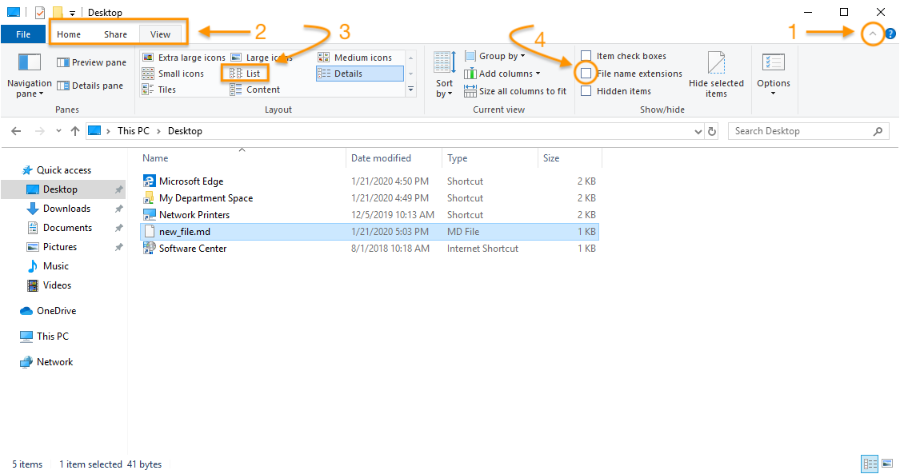
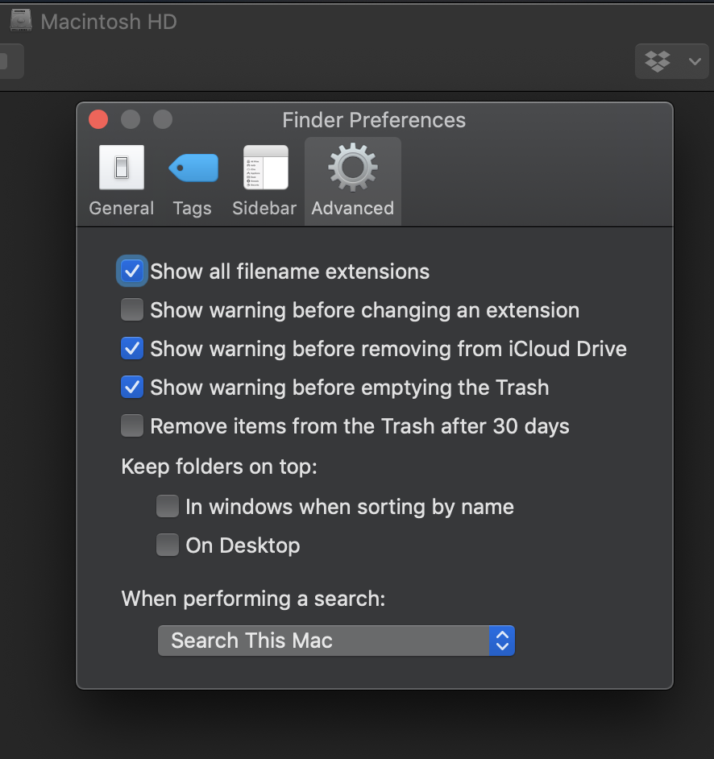
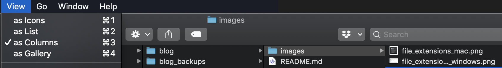
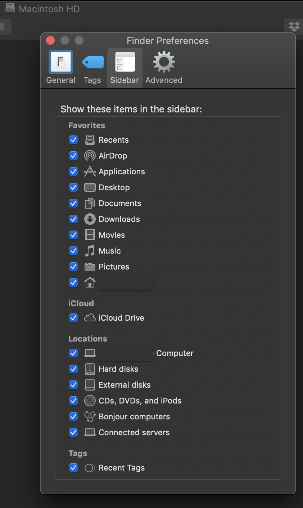
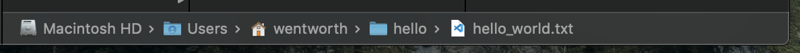
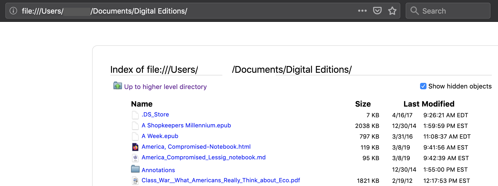

# The File System

The contents of your computer are organized hierarchically in a system of **files** and **directories**. These days, you're just as likely, if not more so, to see a **directory** referred to as a **folder**. That's because in the computer's graphical user interface (GUI), directories are represented, visually, as folders.

Most of us, most of the time, work with the file system on our computers through this interface. MacOS calls its graphical representation of the file system "Finder." Windows calls it "File Explorer."

The GUI provides a lot of flexibility and functionality when it comes to working with files and folders: for example, the ability to drag and drop files from one location in the file hierarchy to another. This is a perfectly good way to work with files, though you'll shortly be introduced to a different way, one with some limitations compared to the GUI but also some remarkable sources of flexibility and functionality of its own.

Making a few adjustments to your GUI right now will help prepare you to make the leap to this other way of working with your file system.

## Windows

Open the pane that reveals File Explorer preferences by using the caret icon at the upper-right corner of an Explorer window (1), then click on the "View" tab (2). Selecting the "List" view of your files (3) will highlight the hierarchical structure of your file system, making the relationships between folders and files in your file system more transparent. Checking the File name extensions box (4) will reveal the extensions at the ends of your filenames (e.g., .png, .docx, .pdf, .jpg). (The box is not checked in the image below. You should check it.)

## macOS

To show **filename extensions** in macOS, go to Finder > Preferences > Advanced and check the box next to "Show all filename extensions." (Depending on what version of macOS you're running, the path may be Finder > Settings > Advanced, and the title bar in the window may read "Finder Settings.")

To **display your files as a list**, you have two options. You can select View > as List from the Finder. But you may find that another option makes your file hierarchy even more transparent: View > as Columns. The "column" view shows the folders and files inside an enclosing folder in the next column to the right.

On your Mac, you'll also find it helpful to make sure that the following, at least, are visible in the **Sidebar**: Desktop, Documents, Downloads, ---'s Computer, and your home folder (home icon).

Finally, to further familiarize yourself with your computer's file hierarchy, show your **file path**: View > Show Path Bar. This will display a bar at the bottom of your Finder window showing you the breadcrumb trail to where you currently are in your file system GUI.

## Navigating your file system through your browser

Did you know that you can navigate your file system through a browser, such as Firefox, Edge, or Safari? This is a good way to get a sense of the system's hierarchical organization. Once you understand how to navigate your files and folders this way, you also have a useful tool for quickly accessing plain text files and testing files you've written in HTML.

To navigate your file system in a browser window, go to the browser's location bar (where you usually see a web address that begins `http://` or `https://`). The http in a web address stands for *hyptertext transfer protocol*. Typing that into your browser location bar tells your browser to go to a location on the web.

Instead of typing `http://`  or `https://`, however, type `file://`, then hit `enter`. (On many keyboards, the `return` key also functions as the `enter` key. If you have no key labeled `enter` on your keyboard, then whenever the instructions in this course tell you to hit `enter`, just hit `return`.) You're now telling your browser that you want to go to a location in your file system rather than a location on the web.

How do you get to a particular location in your file system? Simply type the path to that location in your file hierarchy, beginning with `/Users`  (on a Mac) or `/C:/Users` (in Windows). *Note that this results in 3 forward slashes (`///`) following `file:`*. Keep in mind that the first two are part of the protocol (`file://`) and the third is actually part of the file path (`/Users/...`  or `/C:/Users/...`).

To navigate to your Documents folder, type `file:///Users/your-username/Documents/` (Mac) or `file:///C:/Users/your-username/Documents/` (Windows). Hit `enter`. (In place of `your-username` type your actual username on the computer you're using.)

Depending on your operating system and browser, your browser will either take you to your Documents folder in the operating system's GUI or display the contents of the folder in your browser window.

In the Mac example below, the username has been obscured.

From here, some files (e.g., those ending with the extensions `.md`, `.txt`, `.html`, `.pdf`, `.jpg`, `.png`) should open right in your browser window if you click on them.

{: .warning} 
When you explore your file system through your browser, you may see files and folders that are hidden from you when browsing via your GUI. Their names begin with a `.`, e.g., `.DS_Store`. These files and folders are normally hidden from users for a reason: altering them in any way can seriously affect your computer's functioning. Best to leave them alone unless you're absolutely sure you know what you're doing.
