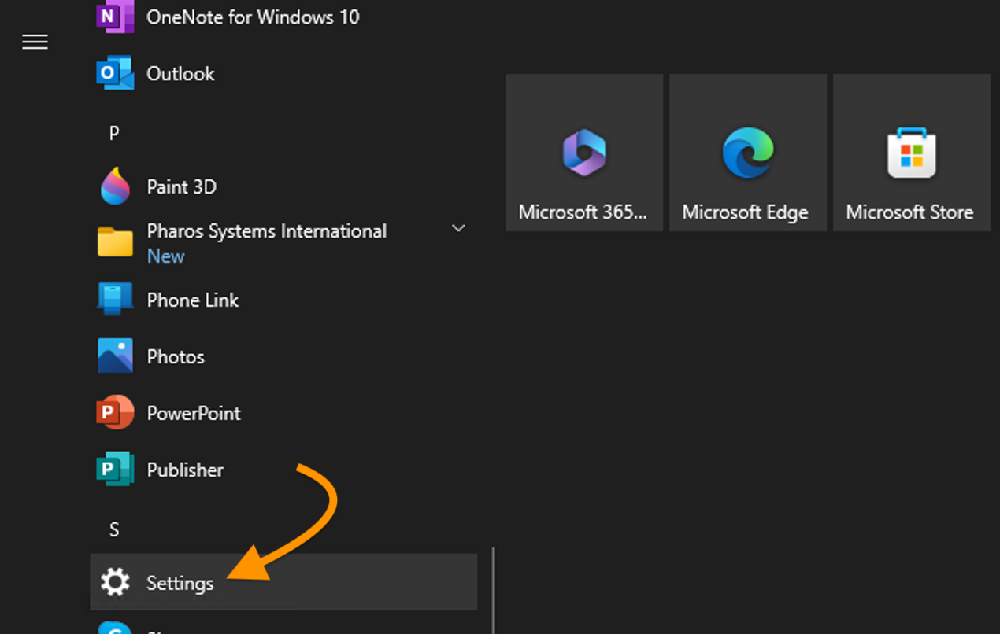
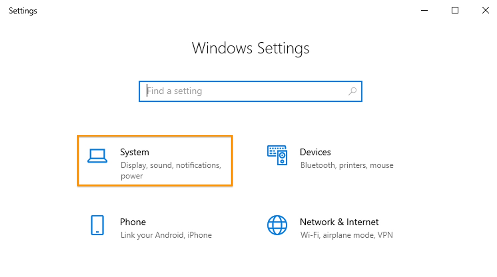
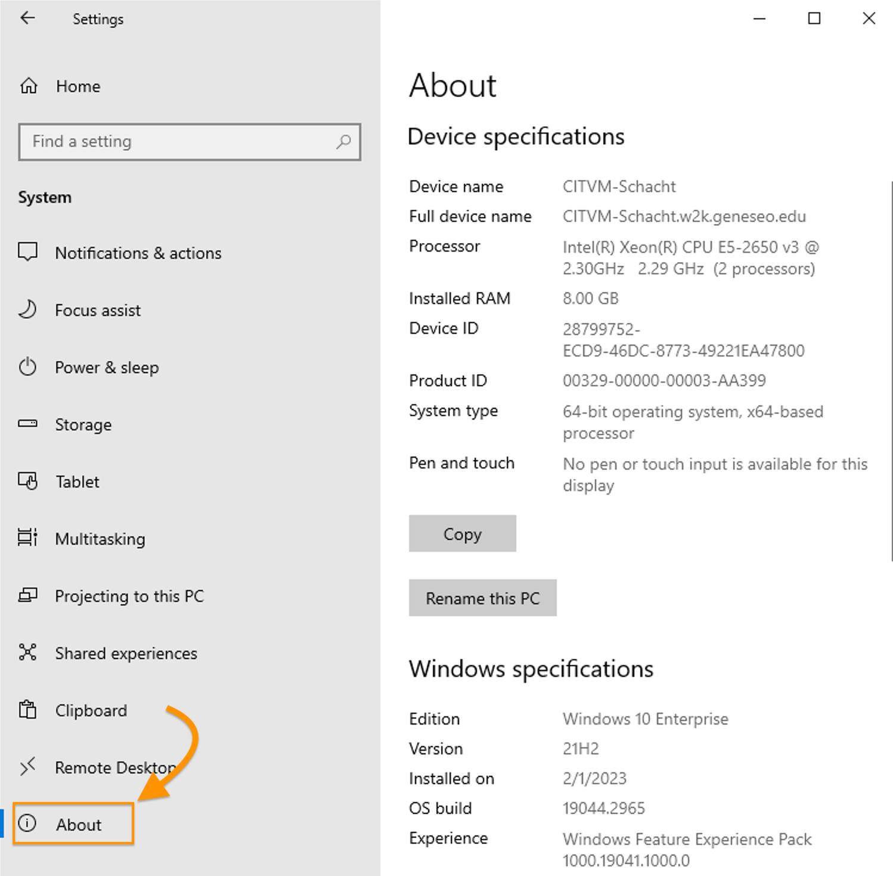
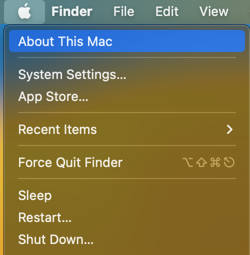
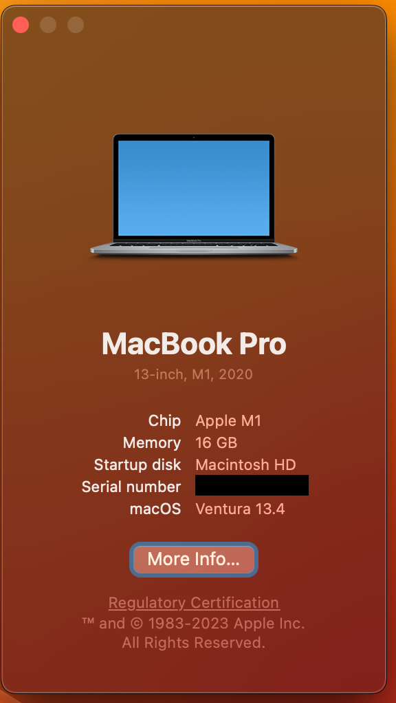
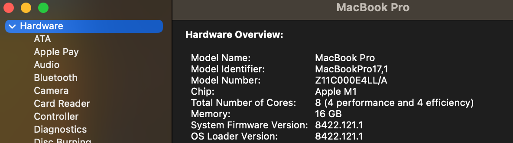

# Operating Systems

An operating system (OS) is a computer's core piece of **software**. The OS makes it possible for different parts of your computer to *operate* in concert. It enables other software on your computer (such as the **programs** or **applications** through which you create word-processing documents or browse the web) to interact with your computer's **hardware** (such as your keyboard, mouse or trackpad, display, or hard drive). It allocates the resources your computer needs to run multiple processes simultaneously. And much, much more. We'll return to operating systems when we get to the command line&mdash;the interface through which a previous generation of computer users worked with their operating systems, and which you can still use on a typical desktop or laptop computer today. Most users, however, interact with their OS through a graphical user interface (GUI), which visualizes the computer's software applications and hardware resources through windows and icons. On a computer running Microsoft's Windows operating system, the GUI presents itself to you as a **File Explorer**. On a computer running Apple's macOS, it presents itself as a **Finder**.

Common desktop/laptop operating systems are **Windows** (Microsoft), **macOS** (Apple), **Chromium** (Google Chromebook), and **Linux** (open source).

Common mobile device operating systems are **iOS** (Apple) and **Android**.

It's useful to know what **version** of your computer's operating systsem is currently installed and running. Here's how to find that information in Windows and macOS.

## Find your OS version: Windows

To see what version of Windows you're running (as well as other information about your Windows computer), go to the Start menu (&#x229e;) and find Settings, or type "Settings" in the search bar.

*Pictured Above: Windows Settings in Start menu*{:.image-caption}

**In the next window that comes up,** select "System."

*Pictured Above: Select "System" from Windows Settings*{:.image-caption}

**In the next window,** select "About."

*Pictured Above: Select "About" in the Systems Menu*{:.image-caption}

## Find your OS version: macOS

To see what version of the Mac operating system you're running (as well as other important information about your computer's hardware, software, and firmware), go to the Apple (&#63743;) menu in Finder and select "About this Mac."

  
*Pictured Above: "About this Mac" in the Mac Finder*{:.image-caption}

**You'll be able to see which version of macOS you're running:** in this case, version 13.4 (Ventura).  

  
*Pictured Above: Basic Mac System Information*{:.image-caption}

**If you click the "More Info&hellip;" button** and, on the next screen, the "System Report" button, you can access complete information about your system, including hardware and firmware info.

  
*Pictured Above: Clicking "More Info&hellip;" Shows Additional System Info*{:.image-caption}

                                                                                                                        