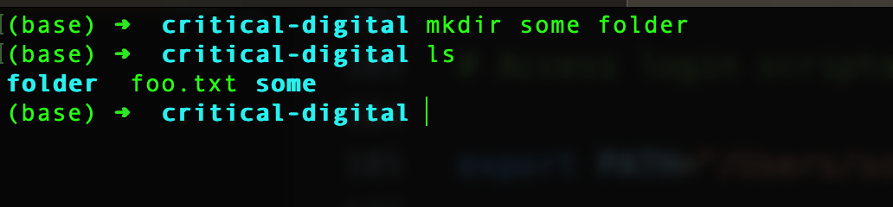

# Creating Files and Folders

Now that you understand a bit about how to get around on the command line, let's make something new there.

Make sure you're in your home directory. Type `pwd`, then `enter`

```zsh
pwd
/Users/your-username # What you should see on a Mac, where your-username is your actual username
/c/Users/your-username # What you should see in Git Bash
/home/your-username # What you should see in Ubuntu
```
If you see something else, type

```zsh
cd ~
```
Use `pwd` again to confirm that you're home.

Let's use the `mkdir` command (short for "make directory") to create a brand-new folder for the work we're going to do. We'll name it `critical-digital` (no spaces). (In the unlikely event that you already have a folder inside your home folder named `critical-digital`, feel free to choose another name to hold your work for our course. Make sure the name doesn't contain any spaces.)

```zsh
mkdir critical-digital
```
Next, we'll use `cd` to descend into the folder. Remember that if you type just the first few letters of the new folder name and hit `tab`, you'll be less likely to get tripped up by typos.

```zsh
cd critical-digital
```

Use `pwd` again to make sure you're in the `critical-digital` folder (or other folder you've created).

```zsh
pwd
/Users/your-username/critical-digital # Mac
/c/Users/schacht/critical-digital # Git Bash
/home/your-username/critical-digital # Ubuntu
```
Go back home.

```zsh
cd ~
```
Go back to `critical-digital`.

```zsh
cd ~/critical-digital
```
You could have left out the `~/` in this last move because `critical-digital` is immediately inside your home directory. But including it also works. So does the full path: `cd /Users/your-username/critical-digital` on Mac, for example.

## Create a file

Use `pwd` to make sure you're inside `critical-digital`. If you aren't, then go there with `cd`. Then, as your next command, type the below, followed by `enter`

```zsh
touch foo.txt
```
The `touch` command is used to create a file without any content. 

The command should succeed silently, producing no output to `stdout`. Now move your terminal window aside, if necessary, so that you can see your GUI (Finder or File Explorer)
and go to your home folder there. You should see an icon for the file `foo.txt`. (&#x1f427; **Ubuntu users:** Remember that the home folder in your Linux installation is not the same as your regular home folder.)

Go ahead and open this file from the GUI by double-clicking it.  It will likely open in Notepad (Windows) or TextEdit (Mac). You'll learn more about these text-editing applications when we get to [text editors]({{ site.url }}/mod-3/text-editors). There should be nothing inside the file.

## Create nested directories

Let's create a directory inside `critical-digital`. First, make sure you're where you want to be by using `pwd`.

```zsh
pwd
/Users/your-username/critical-digital # Mac
/c/Users/schacht/critical-digital # Git Bash
/home/your-username/critical-digital # Ubuntu
```
Not in the right place? Then do this. It will work on all systems.

```zsh
cd ~/critical-digital
```
Use `pwd` if necessary to verify you're where you want to be.

Before we make a new directory, let's revisit the rule, mentioned several times by now, that you shouldn't include spaces in file or directory names. That's curious, isn't it? It may have struck you that you have lots of files and folders on your computer with spaces in the names, perhaps `My Music` or `My Photos`. So why this odd prohibition?

Well, let's see what happens if we try to create a directory with a space in the name. Go ahead and do this (from inside `critical-digital`):

```zsh
mkdir some folder
```
Well that seems to have worked just fine, right? Succeeded silently? Spaces&mdash;no problem! Let's take a peek inside `critical-digital` to see what's there:



Oof! We actually created two folders, one named `some` and the other named `folder`. That's because the shell reads the space character as marking the termination of a command, so it reads `mkdir some` as a complete command. But why did it go on, then, to create `folder` as well? That's because it reads `some` and `folder` as two independent **arguments** to the `mkdir` command. Think of an argument as something like the object of the verb in ordinary English sentence structure. In the sentence, "I kick the ball," "ball" is the object of the verb "kick." COMMAND+ARGUMENT is a structure you'll see a lot at the command line. The thing is, though, a command can take multiple arguments. In English, it wouldn't make sense to say or write, "I kick the ball can." But at the command line, `mkdir some folder` makes total sense: first, make a directory named `some`, then make a directory named `folder`. One command, two arguments.

So how do we make a directory named `some folder`? There are two ways we can do this. One is to use the backslash (`\`) as an "escape" character: a signal to the shell *not* to treat the space that follows as the termination of the argument `some` but instead as an actual space. Thus,

```zsh
mkdir some\ folder
```
will get the job done.

The other option is to put quotation marks around the complete directory name, thus:

```zsh
mkdir "some folder"
```
This approach, too, will succeed in producing a folder named `some folder`. Try one of the above methods now and see for yourself.

Let's now descend into that new folder:

```zsh
cd "some folder"
```
(We could have also written `cd some\ folder`). Let's make another folder inside this one:

```zsh
mkdir some\ other\ folder # we can have multiple spaces in a directory or file name
```
Descend again:

```zsh
cd "some other folder"
```
Make a new file, this time with spaces in the name:

```zsh
touch "my awesome file.txt"
```
Use `ls` to see the file name. (If you'd left off the quotation marks, you'd have created three files named, respectively, `my`, `awesome`, and `file.txt`).

Climb back up a level using `cd ..`

```zsh
cd ..
```
Type `pwd` to see where you are.

## Time-saver: up arrow

If you followed the instructions above, you should now be in `some folder`, which is inside `critical-digital`, which is inside your home folder. You now have at least three ways to get back home. *Don't use any of them yet!* First review them, then read on before making your next move.

(1)
```zsh
cd ~
```
(2)
```zsh
cd ../../
```
(3)
Hit the up arrow (&#x25b2;) at the lower right of your keyboard twice.

We're going to go with (3)&mdash;not because it's better, but just to illustrate the value of &#x25b2;. Because the last command you issued before we got to this point was `cd ..`, typing &#x25b2; will make that command re-appear at the command line, waiting to be executed again with `enter`. Executing the command and repeating this sequence will do the same thing again.

The point is, your shell very helpfully stores a history of the commands you've executed in a given session, and you can scroll up and down in this history using &#x25b2; and &#x25bc;. Getting the hang of using these keys will save you a lot of time in the long run.

Take note, as well, of what method (2) above is showing you. You can climb through multiple levels of your file hierarchy by adding `../` multiple times to the argument of `cd`. You move up two levels at a time with `../../`, three levels with `../../../`, and so on.

One final trick to end this section. Wherever you are now, you can always return to *the most recent previous location* with `cd -`.