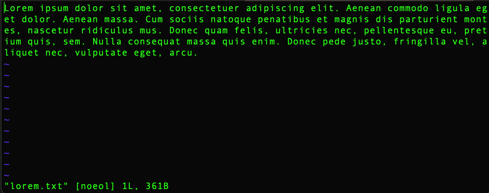
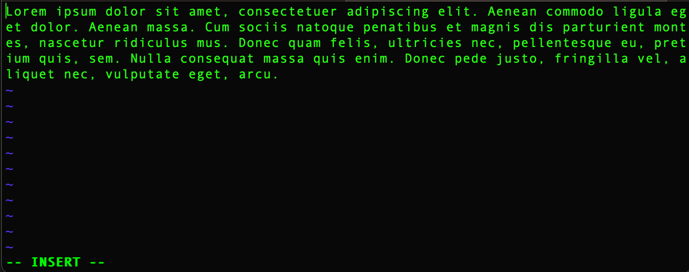
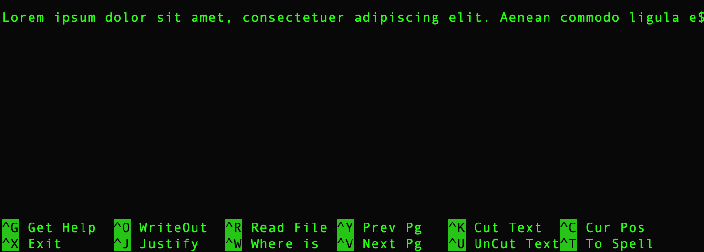

# Editing From the Command Line

You've already seen that you can look inside plain text files from the command line using commands like `cat` and `less`. It's also possible to edit plain text files directly in a terminal window without Notepad, TextEdit, or another external plain-text editing application. 

If you spend enough time on the command line, eventually you'll find yourself in a situation where you'll need to know how to do this, so let's take a moment to see how to perform a few of the most basic editing operations in two of the most common command-line editors, Vim and Nano.

## Vim

Create a new file or open an existing one:

```zsh
vim filename.txt
```
(The `vim` command can be used either to open a file or create one. However, unlike with `touch`, which we used earlier, the file doesn't exist in your filesystem until you save it. If you create a new file with Vim and then exit the Vim editor without saving, the file will be lost.)

The editor will open in the terminal, and you'll see some information about the file at the bottom of your screen. In the example below, an existing file has been opened.



You can use your keyboard's arrow keys or certain of the letter keys to move around in the file. For example, `l` moves your cursor one character to the right, while `h` moves it one character to the left. You can move up and down in a file using `k` and `j`, respectively. You can use `w` to move forward one word at a time and `b` to move back one word at a time. Use `)` and `(` to move forward and back, respectively, one sentence at a time. Use `$`to move to the end of a line, `0` to move to the beginning. In a long document, `ctrl-F` will move you forward (i.e., down) one page, and `ctrl-B` will move you back (i.e., up) one page. 

To begin editing the file, navigate to the location in the file where you want to make a change (such as adding or deleting text) and type the letter `i` (for "insert"). This puts your editor in "Insert" mode, as the bottom of the editor screen will alert you.



You can't navigate the file in insert mode. If you're not where you want to be in the file to make changes, hit `esc` to escape, use the keyboard to go where you want to be, and type `i` again to re-enter insert mode.

Type as you would normally to add text. You can use your keyboard to navigate within the text you're adding.

After making your desired changes, type `esc`, followed by `:w` if you want to save your changes; by `:wq` if you want to save them and exit the file; or by `:q!` if you want to exit without saving any changes. If you typed `:w` to simply save, you can continue editing by entering insert mode again with `i`.

If you type

```zsh
cat filename.txt
```
you can confirm that you saved the file content successfully.

It takes a while to get the hang of Vim's keyboard commands, but once you do, it will seem much less intimidating. There are additional commands that let you perform standard editing tasks such as cut, copy, paste, and undo. One useful feature of Vim is its ability to highlight syntax in documents that include markup (HTML or XML, for example) or programming instructions. Typing `:syntax on` will turn this feature on. (If you're using Git Bash, you may find that you don't have to do anything to turn this feature on.)

## Nano

You may find Nano a little more user-friendly than Vim. Create a new text file by typing

```zsh
nano newfilename.txt
```
Or, if you prefer, re-enter the file you just edited in Vim:

```zsh
nano filename.txt
```
On some Mac systems, executing `nano` will open the text editor Pico, which works identically to Nano.

As with Vim, if you create a new file with `nano`, it doesn't exist in your file system until you save it.

With Nano, you can start moving around in the file and typing right away; no need to switch into a special "Insert" mode.

Long lines in your file may not wrap to the width of the window. A `$` at the end of the line indicates that the line extends beyond the window width, as in the example below.



In Nano, as in Vim, you move your cursor using the keyboard. Type `ctrl-f` to move forward one character, `ctrl-b` to move back one character, `ctrl-n` to move down to the next line and `ctrl-p` to move up to the previous line. Move to the end of a line with `ctrl-e` and to the beginning of a line with `ctrl-a`.

Nano conveniently displays a handy list of commands right at the bottom of the editor window.

Add some text to your file, then hit `ctrl-o`, followed by `enter`. As in Vim, you'll see feedback at the bottom of the window, such as "[Wrote one line.]"

Type `ctrl-x` to exit and close the file in one move.

Again, you can confirm the effects of your editing by using `cat` or `less` followed by the file name right at the command line, or by opening the file in a plain-text editor such as Notepad, TextEdit, or Visual Studio Code (which you'll learn about in the next module).