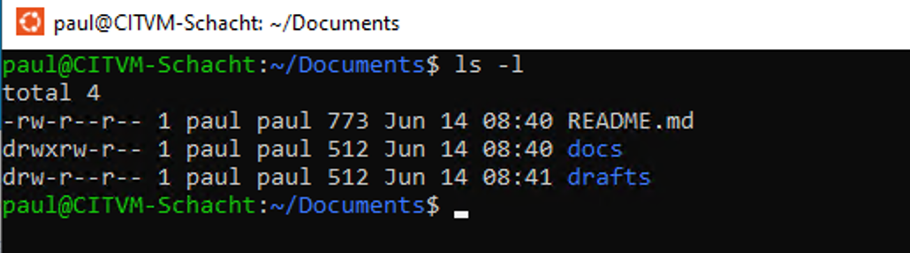
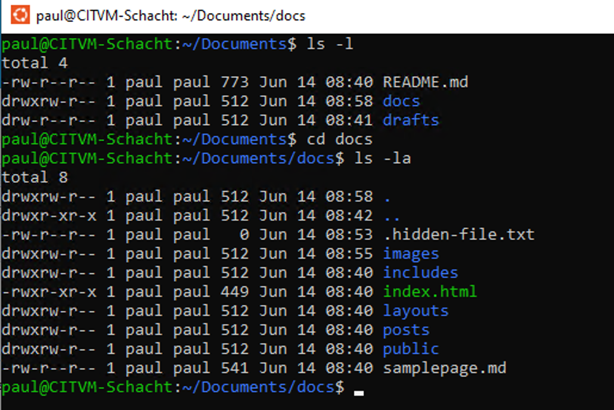
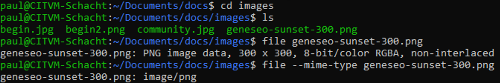

# Getting More Information About Files and Folders

We've seen that the `ls` command will list the files and folders enclosed in a folder. Let's look at a few ways to learn more about a folder's contents.

Passing the `-l` option to `ls` will result in a "long" display of the contents in a vertical list, with additional information displayed at left.

The first column in the list display shows the item type and its permissions. The `-` at the beginning of the first item indicates that it's a file, whereas the `d` at the beginning of the subsequent items indicates that they're directories.

We'll skip over permissions (expressed with the r's, w's, x's, and -'s) for the moment.

The number to the right of the permissions indicates the item's size in blocks. Continuing to the right, we see the owner of the item, followed by the name of any group that has some level of access to the item, followed by the item's date and time of creation, followed by the item's name.

Another useful option is `-a`, for "all." Folders often contain "hidden" files&mdash;files that don't show up in the GUI (unless your GUI settings are configured to display them) and that won't show up with `ls` alone. Below, we've descended into the `docs` directory inside `Documents`, where `ls -la` shows us a file with the name `.hidden-file.txt`. Putting a dot (`.`) at the beginning of a file name will hide it from `ls` alone and  from the GUI (again, depending on your GUI settings).

&#x2757;&#x2757;&#x2757; ***Hidden files are hidden for a reason, and the reason a file is hidden may well be that you shouldn't edit it, move it, rename it, or make any other changes to it unless you're absolutely certain you know what you're doing. Exercise caution.***

You can learn more about `ls` and its options, including how to read the file permissions mentioned above, on [this page](https://www.computerhope.com/unix/uls.htm).

A final command worth mentioning here is `file`. Pass the name of a file to the `file` command, as illustrated below, and you'll get various kinds of information about the file, including its encoding where applicable. Add the `--mime-type` option (also illustrated) and you'll get the file's [MIME](https://www.computerhope.com/jargon/m/mime.htm) type. 

 