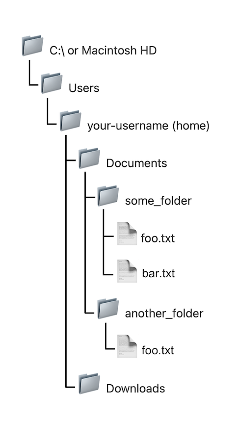

# Getting Oriented

## Know thyself

Launch a terminal, type the following, and press `enter` on your keyboard:

```zsh
whoami
```

The `whoami` command should print out your username. Congrats, you've executed your first command! This is the basic routine at the command line: type a command, press `enter`, see output in your terminal. The terminal is said to *print* the output&mdash;a nomenclature that may be a little confusing at first, if you're used to thinking of printing as something done on paper, with ink, by a physical printer&mdash;and output that's printed to the terminal window is said to be printed to `stdout` (short for "standard output").

Note, however, that sometimes you'll see no output after typing a command and hitting `enter`. You'll just find yourself back at the command prompt. This could mean that your command failed to do what you wanted: for example, find content inside a file using the `grep` command. But often it means that your command succeeded splendidly. This is sometimes described as "succeeding silently." (Even the `grep` example could be read as silent success: the command succeeded in carrying out the search, it just didn't find what you told it to look for, because what you told it to look for wasn't there.)

## Know thy file system

Let's revisit your computer's [file system](/critical-digital-practices/mod-1/file-system) and note some things about its structure.

Your file system's structure is *hierarchical*. It consists of *directories* (also known as *folders*) containing other directories and *files*. This hierarchical structure can also be described as a *tree*.

As illustrated below, at the highest level of the tree we have the computer's main drive. By default, macOS calls this "Macintosh HD," although your Mac will let you rename it to something else. In Windows, the main drive is called the "C:" drive. (The "HD" in "Macintosh HD" stands for "hard disk," and the icon for it in your GUI may look like a hard disk drive, but increasingly, this drive is a solid-state drive with no spinning disk.)

At the next level down we have a "Users" directory, which can hold directories for multiple users. In this example, there's just one user, you, whose username is whatever your username is. This is the **home directory**, on many systems represented in the GUI as &#x1f3e0; or something similar. Beneath this level, the diagram shows two directories, "Documents" and "Downloads." These are at the same level of the hierarchy; they're parallel directories. Of course, these are only two of the many directories inside your home directory. In this example, there are two directories at the next level down, one named "some_folder," the other named "another_folder." Down one more level, inside "some_folder," there are two files, "foo.txt" and "bar.txt". Climbing back up a level, "another_folder", parallel to "some_folder", also contains a file named "foo.txt". We can have two files with the same name within two different directories, but not within the same directory. The same holds true for directory names.



At the command line, we can represent any location in the file system as a *path*. In a shell that accepts Unix-like commands, we use a forward slash (`/`) to separate files and directories along the path. Thus, we'd represent the path to `bar.txt` in the example above as

```zsh
/Users/your-username/Documents/some-folder/bar.txt # macOS
/Users/c/your-username/Documents/some-folder/bar.txt # Git Bash
```
As we've already seen, Ubuntu for Windows installs its files outside the home directory that lives within `Users`. It creates a new directory called `home` to serve as the top level, and within it a directory named with your username. For the sake of illustration, let's say you created a `Documents` directory under your username directory and, in it, you created `some-folder` and `bar.txt`. The path to `bar.txt` in your Ubuntu-Windows installation would then be

```zsh
/home/your-username/Documents/some-folder/bar.txt # Ubuntu for Windows
```
Even in Ubuntu, however, the directory treated as your **home directory** is the one bearing your username (not the one named `home`.) Yes, that's potentially a bit confusing. If you're using Ubuntu, you'll want to take note.

You've already seen that [your browser](/critical-digital-practices/mod-1/file-system#navigating-your-file-system-through-your-browser), too, will recognize this kind of path notation. You can even use it in your GUI. On a Mac, for example, go to File > Go > Go to Folder (or hold down `shift`+`command`+`G`) and type `/Users/your-username/Documents` (substituting your own username for `your-username`) and hit `enter` to see what happens.

One last bit of information before we try out what we now know at the command line. The tilde (`~`) conventionally serves as shorthand for your home folder. Using it will save time and cut down on typos. Thus,

```zsh
~/Documents/some-folder/bar.txt
```
can be used in our example to represent the path to `bar.txt` in all three systems (Mac, Git Bash, Ubuntu-Windows). It also works in the Mac GUI.

## Go places

Above, you used the command `whoami` to get your username. It's good to know *where* you are as well as *who* you are. So type the following command.

```zsh
pwd
```
Unless you navigated away from your home directory during this session, your terminal should display, as output, the path to your home directory. If it displays another location, don't worry. We'll get you back home in short order.

`pwd` is short for "print working directory." Use it frequently at the command line to make sure you're where you want to be before making your next move. 

Now that we know where we are, let's see what's here. Type the following command:

```zsh
ls
```

You should see a number of folders, probably including `Documents`, `Desktop`, and so on. You may also see some files. These are the contents of the current working directory. `ls` will "list" the contents of the directory you are in. 

Wonder what's in the `Documents` folder? Let's try navigating to it with the following command:

```zsh
cd Documents
```

The `cd` command lets us "change directory." (Make sure the "D" in "Desktop" is capitalized.) If the command was successful, you won't see any output. This is normal—often, the command line will succeed silently.

So how do we know it worked? That's right, let's use our `pwd` command again. We should get:

```zsh
pwd
/Users/your-username/Documents
```

Now try `ls` again to see what's on your desktop. These three commands—`pwd`, `ls`, and `cd`—are the most commonly used in the terminal. Between them, you can orient yourself and move around.


## Challenge

Before moving on, take a minute to navigate through our computer's file system using the command line. Use the three commands you've just learned—`pwd`, `ls` and `cd`—eight (8) times each. Go poking around your `Photos` folder, or see what's so special about that root `/` directory. When you're done, come back to your "home" folder with

```zsh
cd ~
```

(That's a tilde <kbd>~</kbd>, on the top left of your keyboard.) One more command you might find useful is `cd ..` which will move you one directory up in the filesystem. That's a `cd` with two periods after it:

```zsh
cd ..
```

### Compare with the GUI

It's important to note that this is the same old information you can get by pointing and clicking displayed to you in a different way.

Go ahead and use pointing and clicking to navigate to your working directory—you can get there a few ways, but try starting from "My Computer" and clicking down from there. You'll notice that the folder names should match the ones that the command line spits out for you, since it's the same information! We're just using a different mode of navigation around your computer to see it.

## Solution

1. Type `pwd` to see where on your computer you are located.
2. Type `cd name-of-your-folder` to enter a subfolder.
3. Type `ls` to see the content of that folder.
4. Type `cd ..` to leave that folder.
5. Type `pwd` to make sure you are back to the folder where you wish to be.
6. Type `cd ~` to go back to your home folder.
7. Type `pwd` to make sure you are in the folder where you wish to be.
8. Type `cd /` to go back to your root folder.
9. Type `ls` to see the content of folder you are currently in.
10. Type `pwd` to make sure you are in the folder where you wish to be.
11. Type `cd name-of-your-folder` to enter a subfolder.