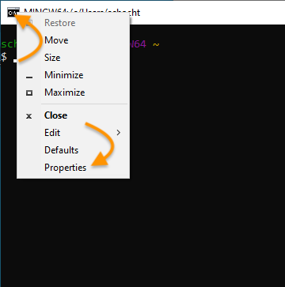
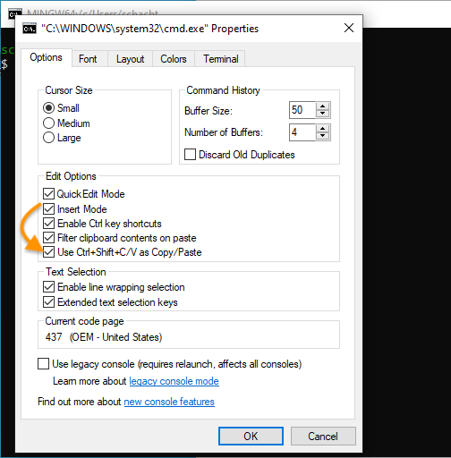

# Types of Commands

## UNIX-like vs. Windows Commands

The commands you type at the Bash/Zsh command line on a machine running macOS or Linux are sometimes similar to, but often quite different from, the commands you type in a Windows shell. Linux and macOS are said to be ["UNIX-like"](https://en.wikipedia.org/wiki/Unix-like) operating systems because of their similarity to the [UNIX](https://www.computerhope.com/jargon/u/unix.htm) operating system developed at Bell Labs in the 1960s. 

There are two reasons why, in this course, you'll learn to use UNIX-like rather than Windows commands, whether or not your computer's main operating system is Windows. The first reason is simplicity. The second is that a major use of the command line is to issue commands on a computer other than your own&mdash;for example, a remote server hosting a website that belongs to you. Since many servers employ UNIX-like operating systems, it's essential to become conversant in UNIX-like commands. 

Still, if you're a Windows user, you'll at least want to get yourself familiar with the way file paths are represented in Windows&mdash;in particular, the use of the backslash (`\`) in some cases where UNIX-like systems use the forward slash (`/`). (Yes, there's a difference between the two kinds of slash, and now that you know, be kind, not patronizing, when you correct friends you confuse them.)

## Using Bash on a Windows machine

You have a few options for installing Bash in a Windows environment. One is to install [Git Bash](https://gitforwindows.org/). This has the advantage that the installation process also installs git, a powerful command-line tool for version-tracking and collaboration.

Another option is to install [Windows Subsystem for Linux (WSL)](https://ubuntu.com/tutorials/install-ubuntu-on-wsl2-on-windows-11-with-gui-support#1-overview), which will enable you to run Ubuntu Linux in a dedicated area of your Windows machine.

### Git Bash

To install Git Bash, follow [these instructions](https://github.com/DHRI-Curriculum/install/blob/v2.0/guides/git.md#installation-instructions-microsoft-windows-10). After following the steps in the installation process, launch Git Bash by going to the Start menu and typing "Git Bash."

Once you've launched the application, you'll want to take one final step. Open the Properties dialog by clicking on the icon in the upper left of the terminal window and selecting "Properties."

In the Properties dialog that comes up, check the box for "Use Ctrl+Shift+C/V as Copy/Paste." Activating this property will enable you to copy-paste from other applications into your terminal window. *Note that when copying from or pasting into the terminal window, you need to hold down the `shift` key *and* the `control` key while typing `V`.

### Windows Subsystem for Linux (WSL)

The easiest way to get WSL is to install it from the Microsoft app store, which you can access from the Start menu. Search there for "Windows Subsystem Linux" or "Ubuntu." 

After launching Unbuntu on your Windows machine, follow the same process described above for Git Bash to enable copy/paste with `ctrl`+`shift`+`C` and `ctrl`+`shift`+`V` for copy/paste.

Finally, note that your WSL installation has its own area within your file system. In your File Explorer, the Linux penguin icon indicates where these are located. As you can see below, the "home" folder of your Linux installation is not the same as your Windows home folder located within This PC > Local Disk(C:) > Users

