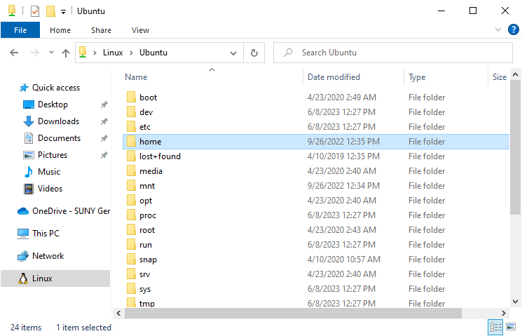

# Types of Commands

## UNIX-like vs. Windows Commands

The commands you type at the Bash/Zsh command line on a machine running macOS or Linux are sometimes similar to, but often quite different from, the commands you type in a Windows shell. Linux and macOS are said to be ["UNIX-like"](https://en.wikipedia.org/wiki/Unix-like) operating systems because of their similarity to the [UNIX](https://www.computerhope.com/jargon/u/unix.htm) operating system developed at Bell Labs in the 1960s. 

There are two reasons why, in this course, you'll learn to use UNIX-like rather than Windows commands, whether or not your computer's main operating system is Windows. The first reason is simplicity. The second is that a major use of the command line is to issue commands on a computer other than your own&mdash;for example, a remote server hosting a website that belongs to you. Since many servers employ UNIX-like operating systems, it's essential to become conversant in UNIX-like commands. 

Still, if you're a Windows user, you'll at least want to get yourself familiar with the way file paths are represented in Windows&mdash;in particular, the use of the backslash (`\`) in some cases where UNIX-like systems use the forward slash (`/`). (Yes, there's a difference between the two kinds of slash, and now that you know, be kind, not patronizing, when you correct friends you confuse them.)

## Using Bash on a Windows machine

You have a few options for installing Bash in a Windows environment. One is to install [Git Bash](https://gitforwindows.org/). This has the advantage that the installation process also installs the git software for you, ensuring that you're all set up for using git and GitHub in one of the later modules.

Another option is to install [Windows Subsystem for Linux (WSL)](https://ubuntu.com/tutorials/install-ubuntu-on-wsl2-on-windows-11-with-gui-support#1-overview), which will enable you to run Ubuntu Linux in a dedicated area of your Windows machine.

### Git Bash

To install Git Bash, follow [these instructions](https://github.com/DHRI-Curriculum/install/blob/v2.0/guides/git.md#installation-instructions-microsoft-windows-10). After following the steps in the installation process, launch Git Bash by going to the Start menu and typing "Git Bash."

Once you've launched the application, you'll want to take one final step. Open the Properties dialog by clicking on the icon in the upper left of the terminal window and selecting "Properties."

In the Properties dialog that comes up, check the box for "Use Ctrl+Shift+C/V as Copy/Paste." Activating this property will enable you to copy-paste from other applications into your terminal window. *Note that when copying from or pasting into the terminal window, you need to hold down the `shift` key *and* the `control` key while typing `V`.

### Windows Subsystem for Linux (WSL)

To install WSL, follow [these instructions](https://ubuntu.com/tutorials/install-ubuntu-on-wsl2-on-windows-11-with-gui-support#1-overview). 

After launching Unbuntu on your Windows machine, follow the same process described above for Git Bash to enable copy/paste with `ctrl`+`shift`+`C` and `ctrl`+`shift`+`V` for copy/paste.

Finally, note that your WSL installation has its own area within your file system. In your File Explorer, the Linux penguin icon indicates where these are located. As you can see below, the "home" folder of your Linux installation is not the same as your Windows home folder located within This PC > Local Disk(C:) > Users

<!--

## What does all that text even *mean*?

Let\'s take a closer look at my terminal window in the screenshot below and see if we can make some more sense of what we\'re being shown. 

At the very top of the terminal window, in the grey bar, you\'ll see that the letters \"zsh\" follow my username, aschmidt. These letters stand for \"z shell\", which is the (latest) MacOS command line shell. Like PowerShell for Windows, zsh is somewhat new, and comes with a lot more features than the old bash shell. We may explore some of these features later in the semester depending on interest and usefulness.

The first line you see in the main screen of the terminal window is an introductory line that notes the last time you were recorded as having logged onto terminal. According to this screenshot, the last time I logged onto terminal was Tuesday, September 28th at 10:13am.

The second line is where the action is. When you see a line that begins with this series of information, you\'ll know that you can start typing!

Starting at the very left, you\'ll see the **username** and, sometimes, the computer name included with it. My username is aschmidt, and my computer name immediately follows that username. This is necessary on my machine, because it\'s owned by the school, and is configured to include a unique computer ID that can be traced back to me.

The next piece of the line is where you\'ll look to determine your **current directory**, that is, where you physically are in your computer\'s directory structure. The \"\~\" shown in the screenshot means that we are in my \"home\" directory. If I were to move to my desktop, that \"\~\" would be replaced with \"Desktop\". It can be easy to lose track of where you are in the terminal, so one of the ways you can keep your wits about you is to check this part of the statement.

Finally, the \"%\" following the current directory section is what is considered the **prompt**. When you see this symbol appear, that means the terminal is ready for you to type a new command. In the old bash shell, this symbol was a \"\$\".

{style="display: block; margin-left: auto; margin-right: auto;" width="670" height="465" api-endpoint="https://canvas.geneseo.edu/api/v1/courses/20408/files/1839044" api-returntype="File"}

### Open your own terminal window! {#open-your-own-terminal-window style="max-width: 900px; margin: auto;"}

Now it\'s time to pull up your own window and see what it looks like on *your* machine!

**Mac users:** Bring up the search bar by typing \"⌘ + space bar\" then start to type in \"terminal.\" Select \"terminal\" from the search results.

**Windows users:** In your search bar (either in directly in your dock or within the \"Start\" button) start typing \"Git Bash\" and select the application from the results.

Try to identify everything we covered on this page in your own terminal window. -->
