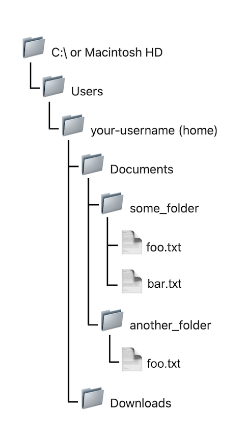
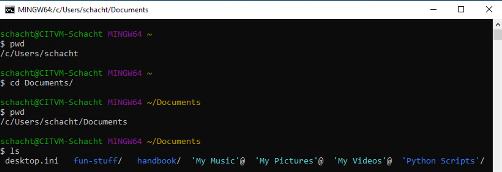

# A Sense of Where You Are

## Know thyself

Launch a terminal, type the following, and press `enter` on your keyboard:

```zsh
whoami
```

The `whoami` command should print out your username. Congrats, you've executed your first command! This is the basic routine at the command line: type a command, press `enter`, see output in your terminal. The terminal is said to *print* the output&mdash;a nomenclature that may be a little confusing at first, if you're used to thinking of printing as something done on paper, with ink, by a physical printer&mdash;and output that's printed to the terminal window is said to be printed to `stdout` (short for "standard output").

Note, however, that sometimes you'll see no output after typing a command and hitting `enter`. You'll just find yourself back at the command prompt. This could mean that your command failed to do what you wanted: for example, find content inside a file using the `grep` command. But often it means that your command succeeded splendidly. This is sometimes described as "succeeding silently." (Even the `grep` example could be read as silent success: the command succeeded in carrying out the search, it just didn't find what you told it to look for, because what you told it to look for wasn't there.) By contrast, if you really do make an error in executing a command, an error message will likely be printed to stdout.

## Know thy file system

Let's revisit your computer's [file system]({{ site.url }}/mod-1/file-system) and note some things about its structure.

Your file system's structure is *hierarchical*. It consists of *directories* (also known as *folders*) containing other directories and *files*. This hierarchical structure can also be described as a *tree*.

As illustrated below, at the highest level of the tree we have the computer's main drive. By default, macOS calls this "Macintosh HD," although your Mac will let you rename it to something else. In Windows, the main drive is called the "C:" drive. (The "HD" in "Macintosh HD" stands for "hard disk," and the icon for it in your GUI may look like a hard disk drive, but increasingly, this drive is a solid-state drive with no spinning disk.)

At the next level down we have a "Users" directory, which can hold directories for multiple users. In this example, there's just one user, you, whose username is whatever your username is. This is the **home directory**, on many systems represented in the GUI as &#x1f3e0; or something similar. Beneath this level, the diagram shows two directories, "Documents" and "Downloads." These are at the same level of the hierarchy; they're parallel directories. Of course, these are only two of the many directories inside your home directory. In this example, there are two directories at the next level down, one named "some_folder," the other named "another_folder." Down one more level, inside "some_folder," there are two files, "foo.txt" and "bar.txt". Climbing back up a level, "another_folder", parallel to "some_folder", also contains a file named "foo.txt". We can have two files with the same name within two different directories, but not within the same directory. The same holds true for directory names.



At the command line, we can represent any location in the file system as a *path*. In a shell that accepts Unix-like commands, we use a forward slash (`/`) to separate files and directories along the path. Thus, we'd represent the path to `bar.txt` in the example above as

```zsh
/Users/your-username/Documents/some-folder/bar.txt # macOS
/Users/c/your-username/Documents/some-folder/bar.txt # Git Bash
```
As we've already seen, Ubuntu for Windows installs its files outside the home directory that lives within `Users`. It creates a new directory called `home` to serve as the top level, and within it a directory named with your username. For the sake of illustration, let's say you created a `Documents` directory under your username directory and, in it, you created `some-folder` and `bar.txt`. The path to `bar.txt` in your Ubuntu-Windows installation would then be

```zsh
/home/your-username/Documents/some-folder/bar.txt # Ubuntu for Windows
```
Even in Ubuntu, however, the directory treated as your **home directory** is the one bearing your username (not the one named `home`.) Yes, that's potentially a bit confusing. If you're using Ubuntu, you'll want to take note.

You've already seen that [your browser]({{ site.url }}/mod-1/file-system#navigating-your-file-system-through-your-browser), too, will recognize this kind of path notation. You can even use it in your GUI. On a Mac, for example, go to File > Go > Go to Folder (or hold down `shift`+`command`+`G`) and type `/Users/your-username/Documents` (substituting your own username for `your-username`) and hit `enter` to see what happens.

One last bit of information before we try out what we now know at the command line. The tilde (`~`) conventionally serves as shorthand for your home folder. Using it will save time and cut down on typos. Thus,

```zsh
~/Documents/some-folder/bar.txt
```
can be used in our example to represent the path to `bar.txt` in all three systems (Mac, Git Bash, Ubuntu-Windows). It also works in the Mac GUI.

## Go places

Above, you used the command `whoami` to get your username. It's good to know *where* you are as well as *who* you are. So type the following command.

```zsh
pwd
```
Unless you navigated away from your home directory during this session, your terminal should display, as output, the path to your home directory. If it displays another location, type the following:

```zsh
cd ~
```
Wherever you are in your file system, this command will always take you home.

The `pwd` command is short for "print working directory." Use it frequently at the command line to make sure you're where you want to be before making your next move. 

Now that we know where we are, let's see what's here. Type the following command:

```zsh
ls
```

You should see a number of folders, probably including `Documents`, `Desktop`, and so on. You may also see some files. These are the contents of the current working directory. `ls` will "list" the contents of the directory you are in.

(&#x1f427; **Ubuntu users:** After you install Ubuntu, you won't have `Desktop`, `Documents`, or any other folders inside your home directory. You can create a `Documents` folder by typing `mkdir ~/Documents` at the command line, followed by `enter`. The command will succeed silently. Follow up with `ls` to see your new Documents folder listed. You'll learn more about `mkdir` command in a later section.)

Depending on your terminal settings and operating system, when you type `ls` you may get a color-coded display of your files and directories&mdash;making it easier to distinguish directories from files&mdash;or you may just get a monochrome display. Whether in color or monochrome, files and directories may be displayed horizontally across your window or in a vertical list. Directories may be displayed with a forward slash (`/`) at the end (a helpful identifier), or they may not. All these settings are adjustable. Eventually, you'll want to take the time to set things up in whatever way works best for you. For now, there's no need to bother.

Wonder what's in the `Documents` folder? Head there with the following command:

```zsh
cd Documents
```

The `cd` command lets us "change directory." (Make sure the "D" in "Documents" is capitalized. Or, better, start typing "Documents" and hit `tab` to auto-complete.) 

Type `pwd` to see your new location in the file system.

Now try `ls` again to see what's in your Documents directory.



You'll use these three shell commands&mdash;`pwd`, `ls`, `cd`&mdash;a lot. As you practice navigating your file system, get in the habit of using them as a triad.

(&#x1f427; **Ubuntu users:** you won't see anything yet if you type `ls` once inside `Documents`&mdash;there aren't any files there yet!&mdash;but you can still follow the navigation instructions below to get a feel for how to get around.)

Now type

```zsh
cd ..
```
This command will take you up one level in the hierarchy, to the folder enclosing the one you're in currently. If you're in `~/Documents`, typing `cd ..` will take you up a level to `~` (home). If you were in, say, `~/Documents/course_files/2021` (That is, the folder named "2021" inside the folder "course_files" inside "Documents"), then typing `cd ..` would take you up a level to `course_files`.

Does this seem like a clunky way to navigate your file system? Well, remember, first, the [bigger picture]({{ site.url }}/mod-2/what-is-the-command-line#the-bigger-picture). Keep in mind, also, that you're just getting started. In time you'll learn some tricks for getting where you need to go much more quickly. And consider, finally, that if you know that where you want to go is `~/Documents/courses/history-courses/200-level/non-western/africa/fall/2021/students` you might actually get there faster by copy-pasting this path after `cd` at the command line than by pointing and clicking at all those folders in your GUI!

## Climb to the top

Perhaps you're wondering what you might see at the highest level of your file hierarchy, `/`. You can go there with `cd /` and see what's there by typing `ls`.

{: .warning}
At the top level of your file hierarchy, you'll see, among other things, folders with the names `bin`, `usr`, `tmp`, and `etc`. You may also see folders with similarly non-transparent names such as `sbin`, `var`, `opt`, and `private`. (Ubuntu users: these, you'll see.) These folders contain files and other folders that provide essential functionality to your operating system. Unless you're certain that you know what you're doing, you should stay out of them. A wrong move here could really mess up your computer.

{: .tip}
This is a good place to emphasize the importance of ***backing up your computer regularly***. If you store important files on one or more cloud services, such as Google Drive or Dropbox, you've got some protection, but the best protection comes from also backing up everything regularly to an external drive. It's absolutely one of the best investments you can make.

## Learning more about a command

Most commands have a "man" (short for "manual") page that you can access from the command line to learn more about the command. These can be a bit daunting to read at first, but they contain a ton of valuable information, and you'll get the hang of scanning them for the information you need. For example,

```zsh
man pwd
```
will pull up the man page for the `pwd` command. You can page through the contents with &#x25b2; and &#x25bc; (on Mac, hold down `fn` as you do this). To exit the man page, simply type `q`. (The `q` command will also get you out of the page view when looking at files with `less`.)

## Bailing out with ctrl-c

Sooner or later, you'll do something at the command line that will produce a whole lot of unintended and unneeded output, or that will cause a command to hang up and not complete. Typing `ctrl-c` will interrupt any command that's running and land you back at the command-line prompt.

## Practice

Take a few minutes now to move around in your file system using the command line. Use the three commands you've just learned&mdash;`pwd`, `ls` and `cd`—eight (8) times each.

## Compare with the GUI

You might want to try putting a terminal window and a Finder or File Explorer window side by side and, as you tool around your file system via the command line, comparing what you see there to what you see in the GUI.