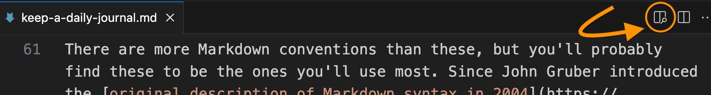
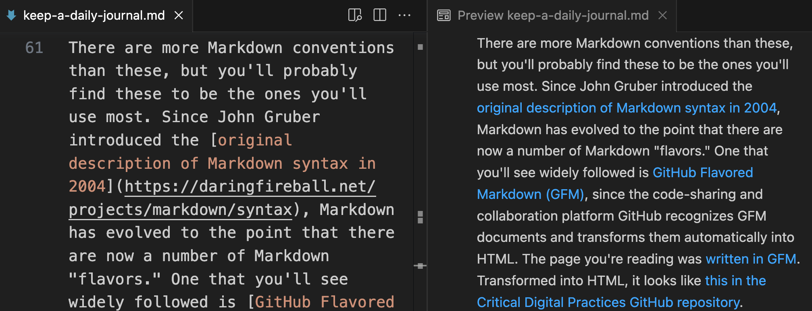

# Keep a Daily Journal in Markdown

Let's put together what you've learned so far about the command line and Markdown to set up a workflow for keeping a daily Markdown journal.

## Why a journal?

As you learn new concepts and acquire new digital skills, it's helpful to document your progress. This documentation will not only confirm just how much you've grown and developed over time but also serve as an invaluable knowledge repository. You'll achieve a lot of your learning through problem-solving. When you solve a problem&mdash;by learning a new shell command, for example, or writing your own custom script to accomplish a specific purpose&mdash;you'll be tempted to think, "Oh&mdash;of course! That's so obvious! There's no way I'll forget *that!*" But you *will* forget. Documenting your solutions to problems will spare you hours of brain-wracking and wheel-reinvention.

Moreover, taking the time to write down not just *what* you did to solve your problem but *how* you solved it and *why* your solution worked will help cement your hard-won understanding. Documenting your learning doesn't just create a personal encyclopedia that you can search for answers you discovered but forgot, in other words; it actually increases the odds that you *will* remember what you learned.

There's a case to be made for journaling as your primary means of note-taking and planning across all your activities, not just your digital learning. If you establish a journaling routine that systematically follows a few rules that you devise yourself, based on whatever works best for you, and keep that routine up religiously, over time you'll find yourself with a body of widely-varied information that lives *in one place* on your computer and that you can easily search for whatever past recorded facts or flashes of insight you need to recover in the moment. You may find this approach preferable to having those facts and insights scattered across innumberable folders and files on your hard drive and in the cloud.

## Why Markdown?

Markdown is a fabulous journaling tool for the [reasons described earlier]({{ site.url }}/mod-3/kinds-of-text#markdown): documents in Markdown are lightweight, easy to read, incredibly interoperable, and readily transformable into other file formats when needed. 

## Why a workflow?

You're most likely to develop a solid journaling routine and stick to it if you establish, at the outset, a few conventions you find easy to follow. You can always change these later.

## Get started: Automate creation of your journal files

For this workflow, we're going to create a new file for each day of journaling. 

We'll want to name our journal files consistently so that when sorted alphabetically, they'll be in chronological order. Putting the date and time right in the name of each file will ensure this result.

It would be tedious to create a file with a name like `journal_2023-06-22.md` every day, however. And chances are we'd end up with typos in some of our file names that would mess up our ordering.

We can achieve better consistency, with a very precise timestamp on each file, by turning to the command line:

```zsh
touch journal_$( date '+%Y-%m-%d_%H-%M' ).md
```
This command uses the program `date` to pull the date and time (down to the hour and minute) from our system clock and put it in a file name that begins with the word "journal" and ends with the `.md` extension. It uses `touch` to create the file.

Give it a try. Open a terminal window and check your location with `pwd`. If you're not in your home folder, use `cd ~` to go there. Execute the command, then look for the new file you created in your GUI. (Or use `ls` at the command line.)

This approach avoids the typo problem, but it's just as tedious as the manual approach, if not more so. We need a better routine, one that will let us create each day's journal file with a few quick keystrokes. We can can achieve this goal by writing a **shell script**. A shell script is nothing more than a series of shell commands stored in a file that will run in succession when you execute it.

### Automation Step 1: Write the script

We can write a very short script to create our daily journal document. We only have to write it once; after that, we just execute the script with a quick terminal command whenever it's time to do some journaling. Every time the script is run, a fresh plain-text document is created with the current date in the file name and the Markdown extension (`.md`) at the file name's end. Including hours and minutes in our time stamp will enable us to have more than one journal file for a single day should the need arise.

Once you get the hang of writing scripts, you'll want to write a bunch of them. So let's begin by creating a folder to hold this script and future ones you'll write. Open a terminal window and use `pwd` to make sure you're in your home folder. If you're not, go there with

```zsh
cd ~
```
Next, create a folder for your scripts. You can call it anything you want. Maybe `scripts` is a good name?

```zsh
mkdir scripts
```
Descend into your new `scripts` folder.

```zsh
cd scripts
```
To create your file, you have a few options. One option is to use `touch`:

```zsh
touch journal.sh
```
However, if you followed the instructions carefully for [installing VS Code]({{ site.url }}/mod-3/text-editors#visual-studio-code), you should be able to create the file and open it in VS Code with a single command:

```zsh
code journal.sh
```
Remember that if you create and open the file using `code`, the file will have only a temporary existence until you save it. If you close the VS Code tab for the file without saving, you'll lose the file contents, and you won't find the file in your file system.

If you're not able to use the `code` command, you can either revisit and carry out the instructions or go to your GUI, right-click on the file name, and tell the Finder or File Explorer to open the file in VS Code.

Other options, of course, include opening the file in any other plain-text editor and opening it in your terminal using, say, Vim or Nano.

Here's what you should paste into the file. (Paste in all of it, including the lines that begin with `#`. You can copy the code with one click by using the clipboard icon that appears when you mouse over the upper right corner of the box below.)

```zsh
#!/bin/bash

# A script to create and open a daily journal file

# Create a new file path and store it in a variable
filename=$HOME/journal/journal_$( date '+%Y-%m-%d_%H-%M' ).md

# Add a reader-friendly date inside the file
echo "$( date '+%A, %B %d, %Y' )" >> $filename

# Open the file in VS Code
code $filename
```
After pasting the above into `journal.sh`, save the file. 

Before going on to the next step, let's take a moment to review what's in the file you created. We'll go through it line-by-line.

#### Shebang

```zsh
#!/bin/bash
```
The first line combines an exclamation point and a pound sign to form what's known as a [shebang](https://www.computerhope.com/jargon/s/shebang.htm). It's followed by the path to your Bash installation. This first line tells your operating system where to find the program (Bash) that will execute your script.

#### Comments

```zsh
# A script to create and open a daily journal file
```
The next line, beginning with `#`, is a comment. Comments are ignored when a script is processed; their purpose is to remind you, or someone reading your script, what the script as a whole and various executable lines within it are designed to do. You can remove or edit the comments in this journal script as you see fit. Just keep in mind that every new line of commentary requires a new `#` at the beginning. VS Code's syntax highlighting is your friend here, helping you to clearly distinguish comments from code in your file.

#### Variable = file path
```zsh
# Create a new file path and store it in a variable
filename=$HOME/journal/journal_$( date '+%Y-%m-%d_%H-%M' ).md
```

The first line of executable code in the file creates a [variable](https://www.computerhope.com/jargon/v/variable.htm) named `filename`, setting the variable equal to the [value](https://www.computerhope.com/jargon/v/value.htm) of the path where you want your script to create a new file. We create variables by inventing names for them. When we want to make use of the variable's value, we put a `$` directly in front of the name. `HOME` is a variable that's typically already set in your operating system; its value is the path to your home folder. If you wanted to, you could replace `$HOME` in this line with the actual path to your home folder: for example, `/Users/c/your-username` in Git Bash.

{: .tip}
Need a refresher on home folder paths in Mac/Git Bash/Ubuntu? Look back at [A Sense of Where You Are]({{ site.url }}/mod-2/where-you-are).

The last part of the path will create a file name that begins with `journal_`, is followed by the current date and time (pulled from your system's clock) and ends with the `.md` file extension. The `$( )` notation allows us to run a command (`date`) and grab the value of the output. (To learn more about the `date` command, type `man date` at the command prompt in a terminal window.)

#### Add a reader-friendly date

```zsh
# Add a reader-friendly date inside the file
echo "$( date '+%A, %B %d, %Y' )" >> $filename
```

The next line of code uses `echo` and `date` to put the date inside your file itself, this time in a reader-friendly format that includes the day and omits hours and minutes (e.g., Thursday, June 22, 2023). Earlier, we used a single right-angle bracket (`>`) as a "redirect" to write contents to a new file. The double right-angle brackets in our script (`>>`) **append** content to an existing file. Instead of writing out the whole path to that existing file again, we reference it using the variable we created earlier.

#### Open the file in VS Code to start journaling

```zsh
# open file in VS Code
code $filename
```
The final line of code opens the file in VS Code, where it's ready and waiting for you to start journaling. If you don't yet have VS Code's command line tools installed, you should comment this line out until you do. Just add a `#` to the beginning of the line. To open the file without using the `code` command, go to it in your GUI. You may have to right-click on it and tell it to open in VS Code rather than TextEdit or Notepad.

### Automation Step 2: Make the script executable

We saw in [Some Plain-Text File Formats]({{ site.url }}/mod-3/kinds-of-text) that files ending in `.sh` are **executable** plain-text files. You can read and edit them like other plain-text files, but you can also ask your computer to **run** the code that's inside them. How?

In [Getting More Information About Files and Folders]({{ site.url }}/mod-2/getting-more-information), we saw that a "long" display of a folder's contents will show us the permissions associated with each file in the folder. The `r` in these permissions stands for **read**, the `w` for **write**, and the `x` for **execute**. In order to run, an executable file must contain valid executable code and also have that `x` in its permissions.

To make your `journal.sh` file executable in macOS or Ubuntu for Windows, make sure you're in your `~/scripts` folder and type the following:

```zsh
chmod u+x journal.sh
```
The `chmod` command will add an `x` to your permissions as user. You can verify this by typing

```zsh
ls -l journal.sh
```
The first three letters in the permissions column should be `rwx`, indicating that you can execute the code in the file.

Things are a little different in Git Bash, where you can't actually change file permissions using `chmod`. However, that first line in your script&mdash;the one with the shebang&mdash;should have made the file executable already. Again, you can verify with `ls -l`.

### Automation Step 3: Run the script
Whether in macOS, Ubuntu, or Git Bash, you can run the code in your executable file by navigating to `~/scripts` using `cd` and typing the following:

```zsh
./journal.sh
```
Or, if you want to skip the navigation step, you can enter the following from anywhere:

```zsh
sh ~/scripts/journal.sh
```
After a few seconds, your new journal file should open in VS Code and be ready for you to start journaling. To repeat, if you don't have VS Code's command-line tools installed, you can navigate to the new file in your GUI (it will be waiting for you in your `~/journal` folder) and open it from there.

## Get journaling in Markdown

The file-creation part of our journaling workflow required a bit of work up front, but the work will pay off. One short line of code at the command line will create each day's journal file in a way that follows a consistent convention. As our journal files pile up, they'll all be in one place, where we can easily search across all of them or find a particular day's writing by looking for the date in the file name. We don't even have to poke around in the GUI to find a file or search in it; VS Code will let us open the entire `journal` folder in one view, listing the individual files in its left navigation pane. After you've created a few journal files, try this out. Assuming (as we've been doing) that your `journal` folder is located at `~/journal`, just type the following at the command line:

```zsh
code ~/journal
```

But now for the real work: *writing*. Let's start with the basics of Markdown syntax.

### Markdown basics

Markdown's syntax is simple.

```
# This is a level-one heading
## This is a level-two heading
### This is a level-three heading

This is body text.

Skip a line to start a new paragraph.

Use _underscores_ or *asterisks* for italics, **double asterisks** for bold text.

Here is an unordered list:

- item
- item
- item

Here is an ordered list:

1. item
2. item
3. item

Here's a [link to a web page](https://en.wikipedia.org/wiki/Ada_Lovelace)

Here's a link to an image file I want to bring into my page: 


```
There are more Markdown conventions than these, but you'll probably find these to be the ones you'll use most. Since John Gruber introduced the [original description of Markdown syntax in 2004](https://daringfireball.net/projects/markdown/syntax), Markdown has evolved to the point that there are now a number of Markdown "flavors." One that you'll see widely followed is [GitHub Flavored Markdown (GFM)](https://github.github.com/gfm/), since the code-sharing and collaboration platform GitHub recognizes GFM documents and transforms them automatically into HTML. The page you're reading was [written in GFM](https://raw.githubusercontent.com/cdl-geneseo/critical-digital-practices/main/mod-3/keep-a-daily-journal.md). Transformed into HTML, it looks like [this in the Critical Digital Practices GitHub repository](https://github.com/cdl-geneseo/critical-digital-practices/blob/main/mod-3/keep-a-daily-journal.md).

A nice feature of VS Code is the Preview pane you can toggle when editing any Markdown document. If your file has the `.md` extension in its name, you should see a little icon off to the right in the top ribbon showing two columns and a magnifying glass. 



Click on the icon to open a pane to the right of your Markdown document showing a preview of how the document would look once transformed into HTML.



### Headings as a search aid 

Headings are a standard way to organize information. One of their obvious benefits&mdash;hopefully evident on this page and throughout this course&mdash;is the way that headings break up the contents of a page both conceptually and visually, facilitating understanding. But a less obvious benefit, perhaps, is that headings and subheadings define categories&mdash;in much the same way that category labels and tags do on a website or social media platform. In those contexts, labels and tags function as aids to search. Used judiciously, they'll perform that function in your journal as well.

The Markdown heading syntax itself calls attention to the similarity. Think of your headings as a tagging system and you'll find it relatively easy to search across all your daily journal pages and quickly find what you're looking for. 

```markdown
# things I learned today

## command line

- to view just the lines at the top (head) of a file from the command line, use `head` instead of `less`
- to view just the lines at the end (tail) of the file, use `tail`
- e.g., `$ head somefile.txt` to print just the first few lines to stdout
```
You don't have to be super rigid about these headings/tags. In the example above, the level-two heading could read "head and tail at command line" or some such. But if you consistently include the key words "command line" in every heading that describes something you learned about the command line, you'll quickly surface all these headings in a multi-file search. <!-- (You'll learn a couple of ways to do such searches in a later module.) -->

## P.S. Don't forget to write!

Whether or not you stick with the workflow outlined here is less important, of course, than whether you find *some* way to regularly document your learning, problem-solving, and brainstorming in a form that's easily searchable. The only workflow that works is one you'll actually use. If this one doesn't work for you, you might want to look at some of the many Markdown-based apps for note-taking, such as [Obsidian](https://obsidian.md/). Or come up with your own. Just don't forget to write!

