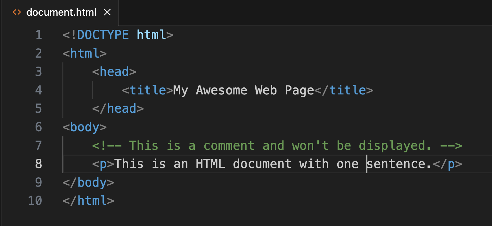

# Some Plain-Text File Formats

Plain text can be used to create many different kinds of documents. Some of the most common plain-text file types you're likely to encounter are those with the following extensions:

- .txt (= *text*)
- .csv (= *comma separated values*)
- .tsv (= *tab separated values*)
- .html (= *hypertext markup language*)
- .xml (= *extensible markup language*)
- .css (= *cascading style sheet*)
- .md (= *markdown*)
- .json (= *javascript object notation*)
- .py (= *python script*)
- .sh (= *shell script*)
- .svg (= *scalar vector graphic*)

Two of the extensions listed above&mdash;`.py` and `.sh`&mdash; are for **executable** files; that is, files whose purpose is to carry out a task on your computer or a computer to which you're connected. The other extensions are for **data** files of one kind or another; that is, files whose purpose is to store information, usually in the form of words and/or numbers.

As we saw in [Understanding Text]({{ site.url }}/mod-3/understanding-text), one property all these files types have in common is that they can be read and edited from the command line or any text editor; no proprietary or highly specialized software application is needed to work with them. They are highly interoperable across software applications and operating systems.

The **data** file types differ from one another principally in the way they **structure** the information they contain. Let's look at just a few examples.

## TXT

Files with a `.txt` extension typically contain a minimum of structure. If you look back at the [Project Gutenberg text of *Walden*]({{ site.url }}/mod-3/one-text-three-views) we examined earlier, you'll see that it gets what structure it has from text conventions that have a long history and wide application in the world of handwritten and printed documents, such as the blank lines that separate paragraphs and the colons (`:`) that separate labels from their contents. Other conventions of this sort frequently seen in `.txt` documents include capital letters and blank lines to set chapter and section titles apart from body text, and asterisks (`*`) or underscores (`_`) to highlight text as important or indicate that a string of text should be construed as the title of a work.

## CSV and TSV

Files with the `.csv` and `.tsv` extensions generally hold tabular data. An example would be a table of historical individuals, with each row of the table containing the individual's name in the far left column, and each successive column (reading left to right) containing some piece of information about the individual, such as their date of birth, their place of birth, their sphere of influence, and the URL of their Wikipedia page.  Line-endings separate one row of data from the next; commas (in the case of CSV) or tabs (in the case of TSV) **delimit** the columns of each row. The first row typically serves as a "header" row labeling the columns. An example with a header row and two rows of data might look like this:

```csv
NAME,DATE OF BIRTH,PLACE OF BIRTH,SPHERE OF INFLUENCE,WIKIPEDIA PAGE
Charles Dickens,"February 7, 1812","Portsmouth, England",literature,https://en.wikipedia.org/wiki/Charles_Dickens
Dorothy Vaughan,"September 20, 1910,"Kansas City, Missouri, USA", mathematics,https://en.wikipedia.org/wiki/Dorothy_Vaughan
```
Notice that some of the data points above are enclosed in quotation marks; that's to prevent the comma within that bit of data (such as a birthdate) from being interpreted as a delimiter. Notice also that the data points (also known as **values**) in a given column don't have to line up vertically.

The information in CSV and TSV files is obviously more difficult to read, most of the time, than the same information displayed in a spreadsheet, where each value occupies a clearly defined rectangular cell, and where the values can be made to line up neatly. 

But these plain-text files have some advantages over spreadsheets. The file size of a CSV or TSV document, especially one containing a large amount of data, is much smaller than that of an Excel document, for example. Meanwhile, a CSV or TSV can easily be imported into Excel or any other spreadsheet application if desired. And as hard as the plain-text version of the data is for human eyes to read, it's not a problem at all for a computer program to work with&mdash;one written in Python, for example, or R.

## HTML

Files ending with the `.html` extension typically hold data meant to be displayed in a browser (e.g., Firefox, Chrome, Safari, Edge), and the data typically consists of text, numbers, and various kinds of rich media such as images, video, and audio. In the language of the web, an HTML file usually presents itself to us as a "page," often one containing links to other pages. You'll learn more about how these links undergird the web as a medium for information exchange in a later module.

As you saw in the section on [text editors]({{ site.url }}/mod-3/text-editors#visual-studio-code), an HTML file separates the data meant for display from various kinds of instructions, enclosed in angle brackets (`<`&nbsp;`>`), that contain information about structure or formatting.

Let's look again at the example you encountered earlier:



In this example, the bits in angle brackets are collectively referred to as **markup**. The first bit of markup you see in the example above is simply metadata about the file itself. It's a "document type declaration" or "DTD"&mdash;basically a little wave at the browser, your GUI, or any other application that can work with it, saying: "&#x1f44b; Hey! I'm an HTML file!"

The markup bits are also commonly called **tags**. Each tag appears twice, as an "opening" tag and a "closing" tag. (The closing tag begins with a forward slash&mdash;for example, `</html>`.) The paired opening and closing tags (also called **elements**) contain various bits of the page's data contents. Everything after the DTD is contained within the opening and closing pairs `<html>` and `</html>`. Within that container, we have two containers, `<head>` &hellip; `</head>` and `<body>` &hellip; `</body>`. Inside `<head>` we have `<title>`. (From this point on, for convenience, only the opening tag will be referenced; the closing one is implied.) Within `<body>` we have a comment, which stands outside the document flow and will be ignored by the browser, and `<p>`, which indicates a paragraph.

As you can see, HTML documents are quite rigorously structured. The `<head>` and `<body>` elements contain distinct types of information. Each can contain additional elements within it, those elements can contain others, and so on indefinitely. Like your computer's [file system]({{ site.url }}/mod-1/file-system), an HTML document has a hierarchical, tree-like structure. In addition, it must adhere to certain structural constraints&mdash;for instance, elements may not overlap each other&mdash;which, if ignored, may cause the document to display improperly in a browser, or not display at all.

{: .tip}
You sometimes see content marked up in HTML described as **HTML code**. Keep in mind that this kind of code is not the same as executable code&mdash;the kind of code written in a programming language such as Python.

## Markdown

Markdown, first introduced in 2004 by [Daring Fireball](https://daringfireball.net/) blogger John Gruber and [Aaron Swartz](https://en.wikipedia.org/wiki/Aaron_Swartz), is a plain-text format that incorporates some of the structural and formatting features we see in HTML, but without the tags. As Gruber explained in [this 2004 blog post](https://daringfireball.net/projects/markdown/), Markdown is designed to accomplish two goals simultaneously. First, it makes the contents of a plain-text document easy for a *human* to read by using many of the same symbols regularly employed for decades in `.txt` files but doing so in a standardized way. Second, precisely because it follows a consistent standard (that is, a **syntax**), Markdown makes the document easy for a *computer program* to read (that is, to **parse**). The computer program parsing a Markdown document can instantly **transform** it into HTML for display on a web page.

The upshot is that Markdown documents are useful in and of themselves&mdash;as highly readable, highly interoperable text&mdash;and also useful as a tool for quickly producing web-ready content without the hassle of typing all those opening and closing HTML tags. This latter use is admittedly best suited to documents with a relatively simple structure, though one of the great features of Markdown is that it accepts HTML tags wherever these are needed for functionality not provided by the standard's core set of symbols.

In the next section, we'll look at how the Markdown syntax works, try our hand at using it, and set up a workflow for keeping a daily plain-text journal in Markdown.