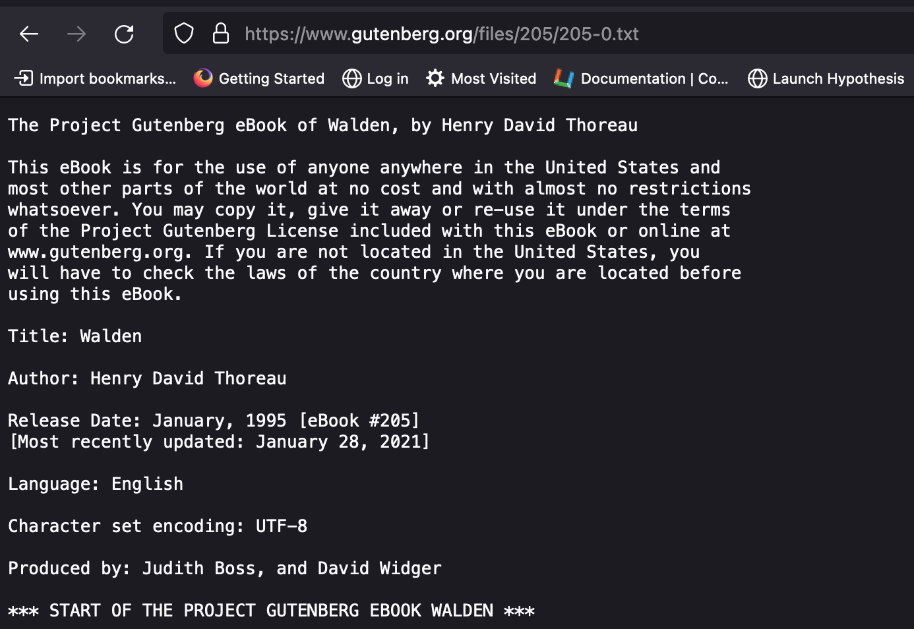
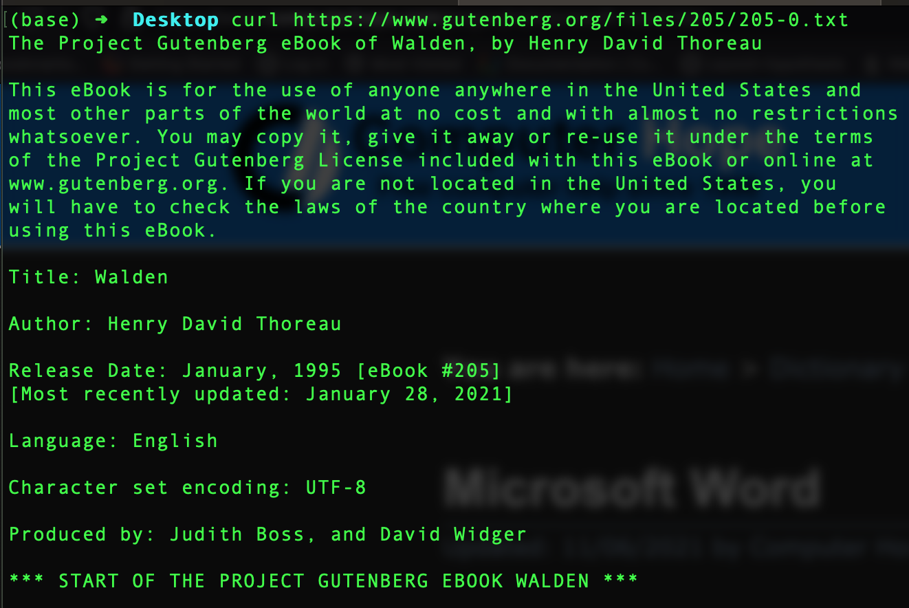
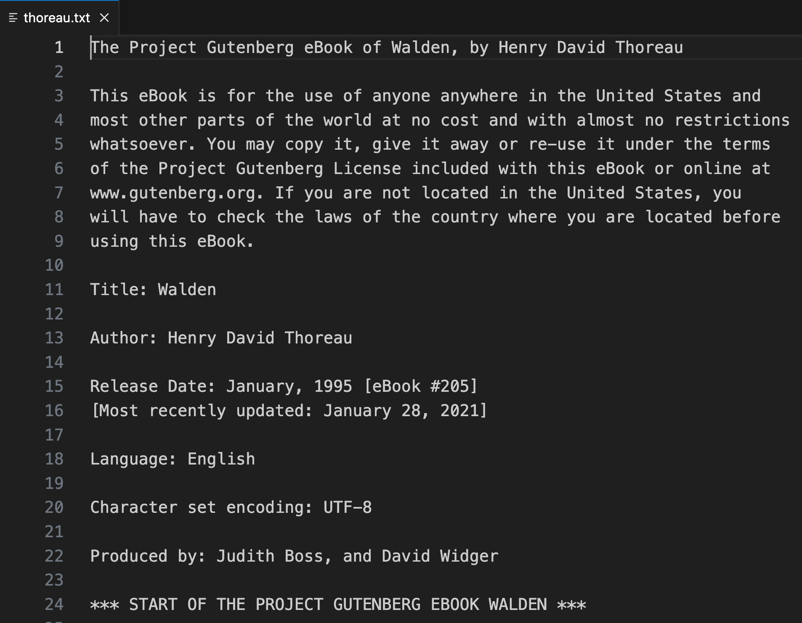

# One Text, Three Views

As previously mentioned, plain text is a highly interoperable format for storing and sharing textual content (e.g., books, blog posts). We can work with plain text documents in any text editor or even in a terminal window. We can begin working on a plain text document with one of these tools, save it, then open it in another and pick up right where we left off. The visual presentation of the text content may vary from one tool to another (for example, by including syntax highlighting), but the content itself will not.

Let's test this out for ourselves.

[Project Gutenberg](https://www.gutenberg.org/) makes public domain works of all kinds available in multiple formats, including plain text. Open a browser and direct it to

`https://www.gutenberg.org/files/205/205-0.txt`

Your browser will show you a plain text version of *Walden and Civil Disobedience*, by Henry David Thoreau. It should look something like this.



Let's pause a moment to notice a couple of interesting things here. Three lines from the bottom of the above screenshot, you're seeing information about the encoding standard that this plain text file is using. It's a different standard from the one we used in the previous section, ASCII. The Gutenberg file is encoded using the **UTF-8** encoding scheme, which is part of the [Unicode](https://home.unicode.org/) standard. Unicode, first introduced in 1991, was developed to address significant limitations in ASCII, which, among other limitations, lacks the capability to represent the variety of the world's languages. Unicode provides not only comprehensive support for text characters across languages but support for a wealth of symbols, including emoji. &#x1f642; 

Notice also, a few lines above, the release date for this copy of *Walden*: 1995. Plain text doesn't only hold up well across operating systems and software applications; it also holds up extremely well over time.

Now open a terminal window and type (or paste)

`curl https://www.gutenberg.org/files/205/205-0.txt | less`

You may have to wait a few seconds, but very soon you should see exactly the same content in your terminal window that you see in your browser. What happened here? You used the `curl` command to get the contents of the file from Project Gutenberg, then you piped the output of that command to `less`, which shows you the first page of the contents. (On a Mac, you can move up and down in the file one page at a time by holding down the `fn` key and using the up/down keys; in Windows, you can use the `PgUp` and `PgDown` keys.)



Whether you’re in your browser or your terminal, you’re looking at a file that's been transferred from a remote computer to your own. The remote computer is one capable of *serving* files to other computers that connect to it&mdash;hence the term *server*. The server *hosts* the file, accepts connections from *client* computers like your own, and responds to a *request* for the file&mdash;such as that made by your browser or by `curl`&mdash;by delivering the file’s contents.

In either case, the file’s contents are printed to your screen, but they’re not *permanently saved* anywhere on your computer’s own drive; they're saved only temporarily in your computer's memory. With `curl`, you can take the next step and save those contents locally by adding a *redirect*. Let's try this out.

To get out of *Walden* in your terminal, type `q`. That will land you back at the command prompt.

Now, navigate to your home folder:

```zsh
cd ~
```
Next, make a directory to store the file you're going to download, and move into that directory. (In the example below, it's named `thoreau-folder`. Use any name you like, but remember: *no spaces!*):

```zsh
mkdir thoreau-folder
cd thoreau-folder
```
Take a peek inside:

```zsh
ls
```
The `ls` command should return no output because you haven't yet put any files in this new directory. If you do see output&mdash;files and/or folders&mdash;you're in the wrong place. Type

```zsh
pwd
```
figure out where you are, and try again!

Once you've created a folder to hold your plain text copy of *Walden* and moved into it, type (or paste)

`curl https://www.gutenberg.org/files/205/205-0.txt > thoreau.txt`

The file will be saved in the folder you created. If you switch over to your Finder or File Explorer and navigate to that folder, you should see a new file there, `thoreau.txt`. (If you're running Ubuntu for Windows, this will be the home folder of your Linux installation, not your Windows home folder.)

You can right-click on it and tell your computer to open it in VS Code. Or, from the command line, you can type:

`code thoreau.txt`

The file will open in VS Code, where it should look pretty much the same as it does in both your terminal window or your browser.

That’s the interoperability of plain text!

