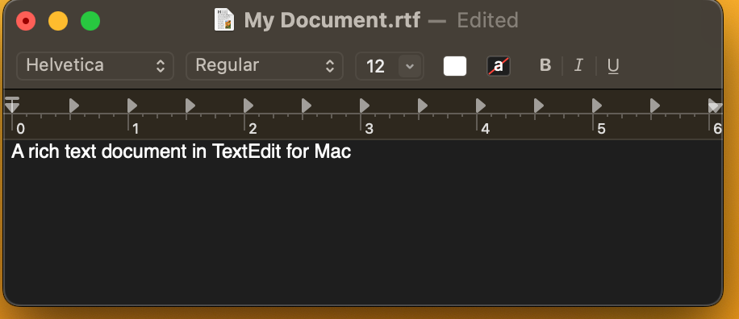

# Text Editors

You've seen that you can create and edit plain text documents [right from the command line]({{ site.url }}/mod-2/editing-from-the-command-line). That's a handy skill to have, especially when you find yourself needing to edit a file on a remote server. You've also seen that Word documents can be saved as plain text files. But it would be an understatement to say that for plain-text editing, Word is not an ideal tool. It's not what Word was built for.

For most work with plain text, you want a dedicated plain-text editor. One in particular, Visual Studio Code, is described below and recommended for this course. But it's worth mentioning two others, Notepad and TextEdit, because they they're the default text editors on Windows and macOS respectively and for that reason will likely thrust themselves upon your attention even if you don't seek them out. 

## Notepad and TextEdit

Notepad and TextEdit provide minimal functionality for plain-text editing. You can launch Notepad by going to the Start menu and typing "Notepad" in the search box. You can launch TextEdit from your Applications folder or by holding down `command` while typing `Space` and typing "TextEdit" in the Spotlight search box.

By default, TextEdit will open in a "rich text" interface and want to save your files with the `.rtf` extension. RTF stands for "rich text format," a file format meant to be interoperable with Word and other word-processing applications. In RTF, you can format text just as you would in Word. You'll know you're looking at an RTF file in TextEdit if you see a formatting toolbar and ruler above your text.

To make TextEdit useful for plain text editing, you'll want to change your settings to tell TextEdit to open new files as "Plain text."

Your new TextEdit files should now look like this:

One other thing to watch for with TextEdit. On newer Macs, by default your TextEdit files will be saved to your iCloud account. Be sure that when you save a TextEdit file, you instead choose a location on your computer itself, rather than iCloud.

## Visual Studio Code

For this course, it's recommended that you install Microsoft's Visual Studio Code and use it for your text editing tasks. VS Code is free to use and has a host of advanced features that will simplify your workflow and help you better understand the structure of your plain text documents. To install it, follow [these instructions if you're on a Mac](https://www.curriculum.dhinstitutes.org/installations/microsoft-visual-studio-code/macos/) or [these instructions if you're using Windows](https://www.curriculum.dhinstitutes.org/installations/microsoft-visual-studio-code/windows/).

{: .important }
Be sure to follow the instructions carefully! Be particularly careful to carry out Step 6 (Mac) or Step 7 (Windows) so that, once it's installed, you'll be able to invoke VS Code from the command line.

One of the most important features of VS Code is **syntax highlighting**. As you'll learn in the next section, one kind of document that requires editing in plain text is an HTML document. Below, you can see that VS Code visually highlights the HTML tags that structure the document.

