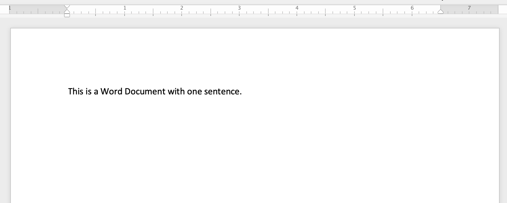
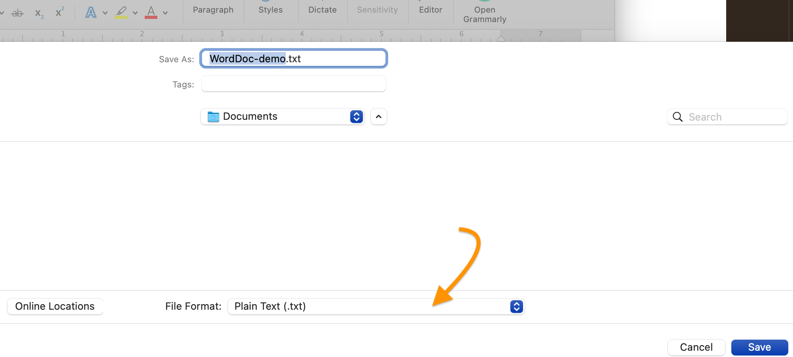
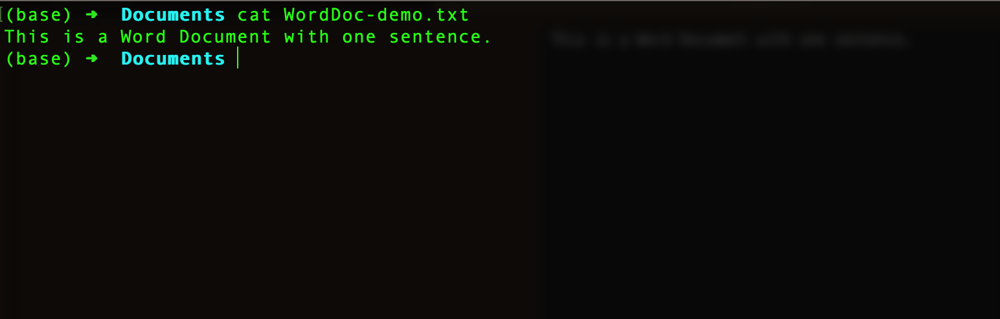
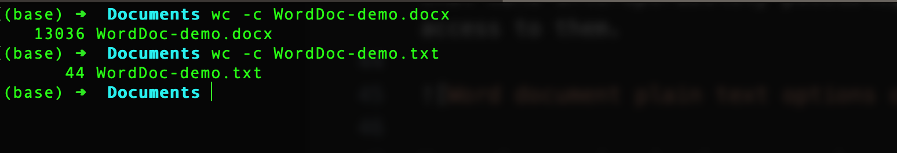
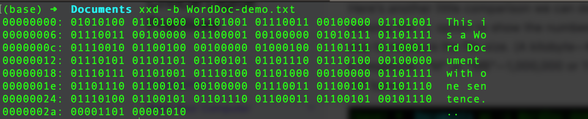

# Understanding Text

Because deep in its guts your computer performs all its operations using 1's and 0's&mdash;numbers&mdash;and because many of the most important contributors to the history of computing have been mathematicians and scientists, and because many of the most important uses for computers are in the STEM fields (science, technology, engineering, math), and because most people think of "computation" as synonymous with "calculation," it's easy to lose sight of the crucial role played in computing by ***words***.

Words are just as essential to computing as numbers. It's a safe bet that more people use computers for text-based tasks&mdash;email, text-messaging, word-processing, website creation, and the like&mdash;than for mathematical ones. And high-level [programming languages](https://www.computerhope.com/jargon/h/highll.htm) like Python, Ruby, Java, and Perl are all written as text, which is only later [compiled](https://www.computerhope.com/jargon/c/compile.htm) into [machine language](https://www.computerhope.com/jargon/m/machlang.htm) so that the computer can execute its commands. (Two of the earliest high-level programming languages were [FORTRAN](https://www.computerhope.com/jargon/f/fortran.htm) and [COBOL](https://www.computerhope.com/jargon/c/cobol.htm), the latter evolving from work by the early computing pioneer [Grace Hopper](https://en.wikipedia.org/wiki/Grace_Hopper).)
  
But not all computer text is the same. If you have Microsoft Word installed on your computer, you can easily demonstrate this for yourself.

## A peek inside a Word file

Here's a simple Word document containing a single sentence, saved in Word's default `.docx` format. (If you haven't done so already, now is a good time to make sure that your Finder or File Explorer is [showing you the extensions at the end of file names](/mod-1/file-system), such as .docx, .pdf, .png, .jpg, .txt. ).

If we take a peek inside this document from a terminal window, using the `cat` command you [learned about previously](/mod-2/create-a-cheat-sheet#cat), here's what we see:

This is just a bit of the output we get when we stream the file contents using `cat`. There's lots more. It isn't gibberish to Word, but it certainly is to human eyes. It's not *human-readable*, even though it's *machine-readable*.

There was a time when, if you wanted to open a Word document, you were pretty much out of luck if you didn't have the Microsoft Word application installed on your computer. Even then, a Word document created on a Windows computer wouldn't open on a Mac, and vice versa. Word documents were barely **interoperable** with different word-processing applications or operating systems. (We'll come back shortly to the important principle of interoperability.) That's because the way Word *encoded* text was highly specific&mdash;and proprietary.

Nowadays, Word is more interoperable than it used to be. Word documents can be opened on all major operating systems and in more than one software application. And if you create your documents using free and open source software such as [LibreOffice](https://www.libreoffice.org/), your documents can be readily used by someone using Word.

Still, even now, there are significant limits to Word's interoperabilty, as you may have discovered for yourself if you've ever tried to copy and paste text content from a Word document into, say, a web form or the editor for a website content management system such as WordPress and found yourself dealing with strange characters and unexpected line breaks.

## Plain text

Let's see what happens if we save the same one-sentence Word file in a format other than the default `.docx`. We can do this by choosing File > Save As and using the dropdown menu in the dialog that pops up to select a different file format.

As the screenshot above shows, the dropdown appears at the bottom of the window, and you can change the format of the file copy you're creating to "Plain Text." It will be saved with the `.txt` extension at the end of the file name.

If you hit `Save`, you'll find that you're not quite done, though, with the file conversion process. Word wants to know what *kind* of plain text you'd like to use for your file copy. No text, it turns out, is *entirely* plain, because *all* text is encoded: each character you type at the keyboard has its equivalent representation as 1's and 0's stored in your computer's memory.

We're going to save our Word file in [ASCII](https://www.computerhope.com/jargon/a/ascii.htm), one of the oldest encoding *standards*. ASCII (pronounced "ASK-ee") is an acronym for "American Standard Code for Information Interexchange." The key word in that very technical sounding name is "Standard." Standards are what make interoperability possible, because they can be followed by any person&mdash;or machine&mdash;with access to them.

Note the warning in the screenshot above that saving a Word file as plain text will cause text formatting&mdash;bold, italic, and other formatted text, as well as varieties of font style&mdash;to be lost, together with images and other objects. The relative absence of formatting is a key part of what makes plain text&mdash;whatever its encoding&mdash;plain. We *can* format plain text, but we do so in a way that keeps the text itself and the formatting instructions separate from one another. This separation may look like a limitation, but in fact it's a key part of plain text's interoperability and flexibility, as we'll have occasion to see.

Let's go back to the command line to see what our plain text version of the Word file looks like there, once again using the `cat` command.

Nice.

Here's another little comparison we can do at the command line, using the `wc` command and passing the `-c` option to show the number of [bytes](https://www.computerhope.com/jargon/b/byte.htm) in both the `.docx` file and the `.txt`. This is one way to measure the file size. (A kilobyte&mdash;typically abbreviated "K"&mdash;is equivalent to 1,000 bytes, a megabyte&mdash;"M" or "MB"&mdash;1,000,000 or 106 bytes, a gigabyte&mdash;"G" or "GB"&mdash;1,000,000,000 or 109 bytes.)

The `.docx` file weighs in at 13036 bytes, i.e., a little over 13K. The `.txt` file is much lighter at 44K. Notice also that 44 is exactly the number of characters in the file, if we include two invisible characters that Word included as part of its conversion. At the command line, we can see the ASCII byte equivalent for each character.

## A story

Let's end this section with a personal anecdote from Amanda Schmidt, former Assistant Director for Digital Learning and Humanities in Geneseo's Center for Digital Learning. Amanda writes about her own early experience with word-processing, ending with a mention of Notepad, a plain-text editor available on all Windows sytems. We'll encounter several different plain-text editors in the next section.

> When I was in elementary school, I thought I was going to be a writer. I would spend hours and hours on my dad's desktop computer, typing away at stories and make-believe newspapers in Microsoft Word. As far as I knew back then, that was the only way to write on a computer. Every day after school I would be dropped off by my bus at my grandparents' house to wait for my dad to pick me up a couple of hours later, when he got out of work. For a burgeoning child-writer, these hours were torturous, because, while I could keep my stories on a flash drive to move to other computers as needed, the computer at my grandparents' house *did not have Microsoft Word on it.* What was I to do? All of my amazing ideas for what I was already working on festered in my brain, and the itch to concoct and consider and knock words into place on the page as I typed gnawed against my little tween angst. It was beyond frustrating. 

> And when I learned about the built-in text editor on Windows (the only OS my family would allow... we all have our loyalties, I suppose), Notepad? Imagine my elation, then almost instant, crushing devastation when there was still no way to open my MS Word document in that platform. Why was it so impossible to view what I wrote in a different program? It was only text, anyhow, plain and simple... right?