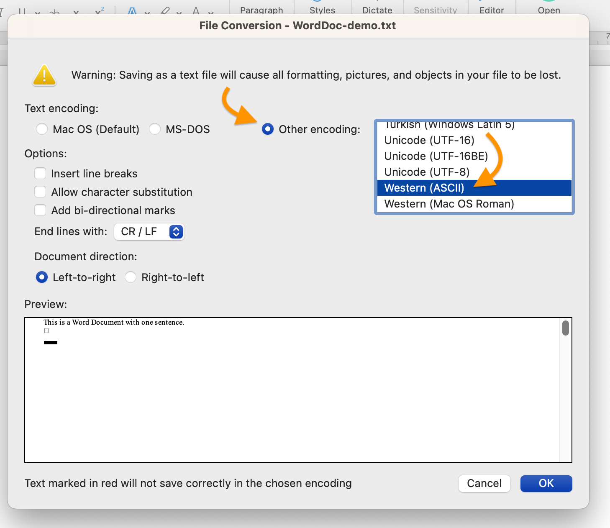
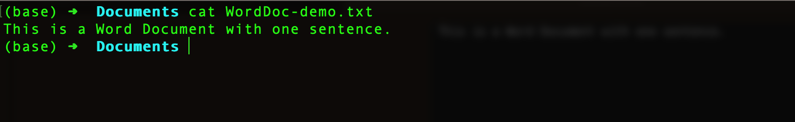

# Understanding Text

Because deep in its guts your computer performs all its operations using 1's and 0's&mdash;numbers&mdash;and because many of the most important contributors to the history of computing have been mathematicians and scientists, and because many of the most important uses for computers are in the STEM fields (science, technology, engineering, math), and because most people think of "computation" as synonymous with "calculation," it's easy to lose sight of the crucial role played in computing by ***words***.

Words are just as essential to computing as numbers. It's a safe bet that more people use computers for text-based tasks&mdash;email, text-messaging, word-processing, website creation, and the like&mdash;than for mathematical ones. And high-level [programming languages](https://www.computerhope.com/jargon/h/highll.htm) like Python, Ruby, Java, and Perl are all written as text, which is only later [compiled](https://www.computerhope.com/jargon/c/compile.htm) into [machine language](https://www.computerhope.com/jargon/m/machlang.htm) so that the computer can execute its commands. (Two of the earliest high-level programming languages were [FORTRAN](https://www.computerhope.com/jargon/f/fortran.htm) and [COBOL](https://www.computerhope.com/jargon/c/cobol.htm), the latter evolving from work by the early computing pioneer [Grace Hopper](https://en.wikipedia.org/wiki/Grace_Hopper).)
  
But not all computer text is the same. If you have Microsoft Word installed on your computer, you can easily demonstrate this for yourself.

## A peek inside a Word file

Here's a simple Word document containing a single sentence, saved in Word's default `.docx` format. (If you haven't done so already, now is a good time to make sure that your Finder or File Explorer is [showing you the extensions at the end of file names]({{ site.url }}/mod-1/file-system), such as .docx, .pdf, .png, .jpg, .txt. ).

Let's see if we can take a look inside this file from the command line using `less`.

Our shell warns us that this Word file may be a [binary file](https://www.computerhope.com/jargon/b/binaryfi.htm)&mdash;that is, a file that contains more than just text. Trying to view a binary file with `less` or `cat` will output a bunch of characters to our terminal that will look like gibberish; it might also have some unpredictable and adverse effects on our shell. We'll politely decline to go any farther by typing `n`, for "no." That will land us back at the command-line prompt.

Now let's see what happens if we save the same one-sentence Word file in a format other than the default `.docx`. We can do this by choosing File > Save As and using the dropdown menu in the dialog that pops up to select a different file format.

As the screenshot above shows, the dropdown appears at the bottom of the window, and you can change the format of the file copy you're creating to "Plain Text." It will be saved with the `.txt` extension at the end of the file name.

If you hit `Save`, you'll find that you're not quite done, though, with the file conversion process. Word wants to know what *kind* of plain text you'd like to use for your file copy. No text, it turns out, is *entirely* plain, because *all* text is encoded: each character you type at the keyboard has its equivalent representation as 1's and 0's stored in your computer's memory.

We're going to save our Word file in [ASCII](https://www.computerhope.com/jargon/a/ascii.htm), one of the oldest encoding *standards*. ASCII (pronounced "ASK-ee") is an acronym for "American Standard Code for Information Interexchange." The key word in that very technical sounding name is "Standard." Standards are what make interoperability possible, because they can be followed by any person&mdash;or machine&mdash;with access to them.

Note the warning in the screenshot above that saving a Word file as plain text will cause text formatting&mdash;bold, italic, and other formatted text, as well as varieties of font style&mdash;to be lost, together with images and other objects. The relative absence of formatting is a key part of what makes plain text&mdash;whatever its encoding&mdash;plain. We *can* format plain text, but we do so in a way that keeps the text itself and the formatting instructions separate from one another. This separation may look like a limitation, but in fact it's a key part of plain text's interoperability and flexibility, as we'll have occasion to see.

Let's go back to the command line to see what our plain text version of the Word file looks like there, this time using the `cat` command. (We could use `less` again, but for this example `cat` will more clearly demonstrate what's different now.)

No warning this time. Our terminal just shows us the text content of the file. Nice.

Now let's do another comparison, using the `wc` command and passing the `-c` option to show the number of [bytes](https://www.computerhope.com/jargon/b/byte.htm) in both the `.docx` file and the `.txt`. This is one way to measure the file size. (A kilobyte&mdash;typically abbreviated "K"&mdash;is equivalent to 1,000 bytes, a megabyte&mdash;"M" or "MB"&mdash;1,000,000 or 106 bytes, a gigabyte&mdash;"G" or "GB"&mdash;1,000,000,000 or 109 bytes.)

The `.docx` file weighs in at 13036 bytes, i.e., a little over 13K. The `.txt` file is much lighter at a mere 44 bytes or .044K. Notice also that 44 is exactly the number of characters in the file, if we count two invisible characters that Word included as part of its conversion. (*NB*, spaces and punctuation are also characters.) At the command line, we can see the ASCII byte equivalent for each character.

It would appear that the content we care about represents well under 1% of what's in the Word file. The other 99+% is providing valuable functionality, but it may also make it harder for us to use the content we care about in other contexts.

{: .note }
Your shell may not have `xxd` installed, so you may not be able to run this command on your own machine.

## The interoperability of plain text

There was a time when, if you wanted to open a Word document, you were pretty much out of luck if you didn't have the Microsoft Word application installed on your computer. Even then, a Word document created on a Windows computer wouldn't open on a Mac, and vice versa. Word documents were barely **interoperable** with different word-processing applications or operating systems. That's because the way Word *encoded* text was highly specific&mdash;and proprietary.

Nowadays, Word is more interoperable than it used to be. Word documents can be opened on all major operating systems and in more than one software application. And if you create your documents using free and open source software such as [LibreOffice](https://www.libreoffice.org/), your documents can be readily used by someone using Word.

But there are still significant limits to the interoperabilty of Word and other word-processed documents, as you may have discovered for yourself if you've ever tried to copy and paste text content from a Word document or a Google doc into, say, a web form or the editor for a website content management system such as WordPress and found yourself dealing with strange characters and unexpected line breaks.

Plain text, by contrast, is highly interoperable across operating systems, software applications, and platforms, as we'll shortly have occasion to see.