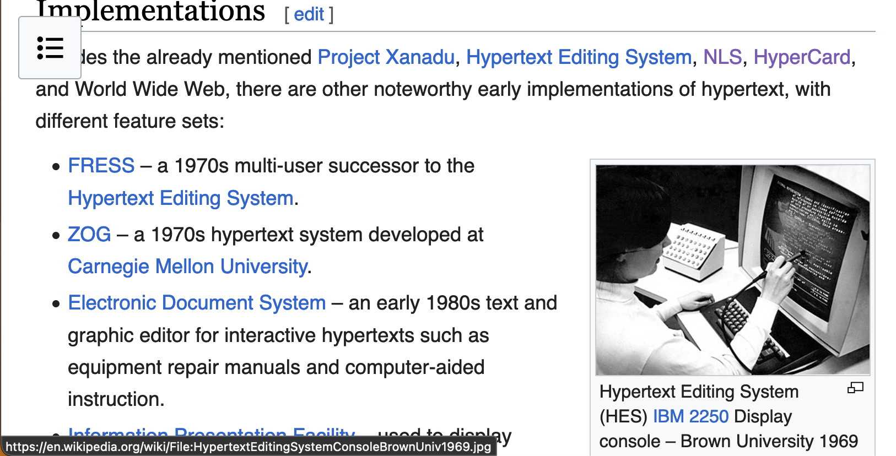
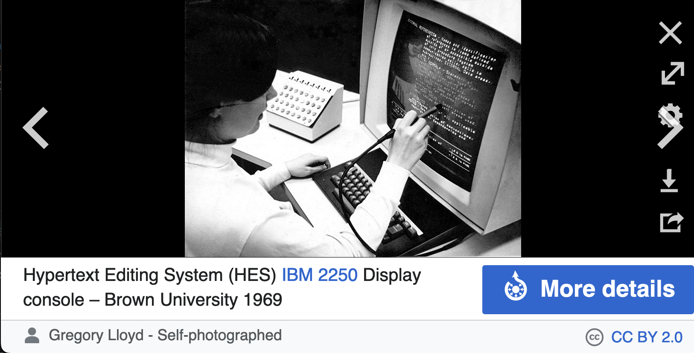
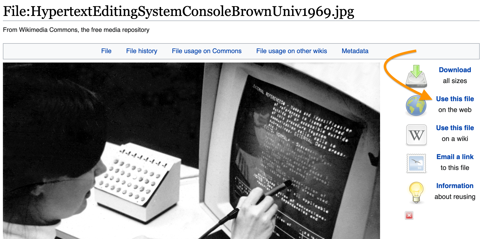
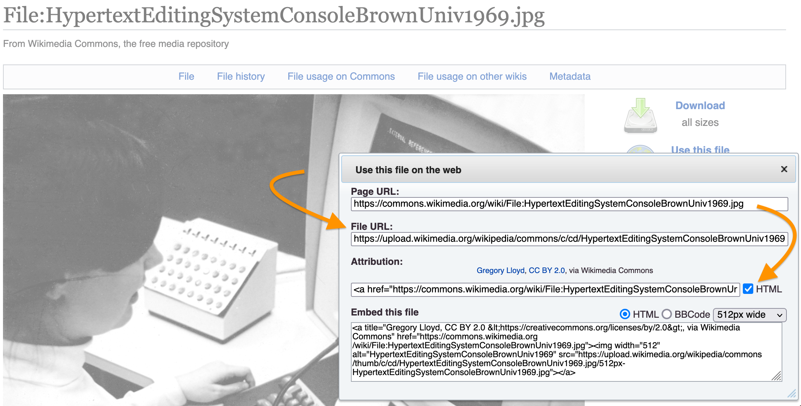

# Attributes, Links, Images

## Attributes

Many HTML elements can take one or more **attributes**. Attributes provide additional information about an element. Attributes are included in the element's opening tag and typically come in the form of a name/value pair: `name="value"`. You'll see some examples of attributes in the discussion of links and images below.

## Links

You've seen that [links are the beating heart of the web]({{ site.url }}/mod-4/what-is-the-web). How are they made?

To make a link, wrap the text you want to serve as the link in the `<a>` element. Use the `href` attribute to make your link point to the desired destination on the web, assigning the URL of that destination to the value of the attribute.

To try this out, open the `index.html` file you created in [HTML Basics]({{ site.url }}/mod-4/html-basics), or create a new file with the `.html` extension and the elements required in all html documents (`<html>`, `<head>`, `<body>`). Turn some paragraph text into a link like so:

```html
<p>This is a link to the <a href="https://creativecommons.org">Creative Commons</a> website.</p>
```
Open your `.html` file in a browser and test the link by clicking it. If clicking the link doesn't take you to your desired destination, or your link doesn't look as expected, here are a few things to check:

- Did you supply a complete URL as the value of `href`? You must include `http://` or `https://` (depending on the site you're pointing to) in your URL. In the example above, it wouldn't suffice simply to point to `"creativecommons.org"`.
- Is the rest of the URL typed correctly? It's incredibly easy to mistype a URL or to misremember the **top-level domain** (e.g., `.edu`, `.org`, `.com`) of the site you want to reference. (Scammers and pranksters like to play on that last human vulnerability, as they did in [an infamous example from 1997](https://www.cnet.com/tech/services-and-software/whitehouse-com-goes-to-porn/)). A good habit to get into is to pay a quick visit in your browser to the site you want to link to, verify that you're in the right place, copy the URL from the browser location bar, and paste it into your HTML document.
- Did you remember to surround your URL in quotation marks? That's the protocol for most attribute values.
- Did you remember to include your closing tag (`</a>`)? If not, you may end up with a *lot* of blue, underlined text in your document. The closing tag defines where your linked text ends.

## Images

[As mentioned earlier]({{ site.url }}/mod-4/what-is-the-web#birth-of-the-web), the Mosaic browser's ability to integrate images with text was a crucial driver of the early web's popularity. This integration was achieved with the `` element, which takes an attribute, `src`, whose value can be any openly accessible image file on the web, whether locally (that is, on the same server that's hosting the web page incorporating the image) or somewhere else, say on another website.

### Using a URL for src

Our [discussion of the web's prehistory]({{ site.url }}/mod-4/what-is-the-web#pre-history) incorporates an image from [Wikimedia Commons](https://commons.wikimedia.org/wiki/Main_Page) showing a user at Brown University's Hypertext Editing System (HES) console in 1969. To include this image in the page, it wasn't necessary to download an image file from Wikimedia Commons and upload it to the Critical Digital Practices website. All that was necessary was to point to that image's URL on the Wikimedia Commons site.

```html

```
Try this out in your own practice file. The image should display in your browser once you save the file and refresh the page.

Notice something important about this bit of markup. It consists *only* of the element name, attribute, and value. The element isn't wrapping any text content. We call elements like this **empty elements**. Another example of an empty element is `<br />`, which creates a break between two lines without inserting a blank line between them.

Because these elements don't wrap anything, they don't need both an opening and a closing tag, though the closing tags for these *could* be supplied (with no content between opening and closing tag): e.g., `<br></br>`

A widely used XML-based version of HTML, known as XHTML, requires that such elements include the forward slash that would ordinarily be part of the closing tag, as in the `` example above, or as in `<br />`. When written this way, tags are said to be **self-closing**.

Though making elements self-closing with a forward-slash is only *required* in XHTML, it does no harm in other versions of HTML.

### Using a local file for src

To repeat, a "local" file is one that lives on the same server as the one serving your web page. Let's recreate that sort of situation on your own machine.

Inside your `critical-digital` directory (or whatever directory holds your practice file), create another directory and name it `images`.

Drag (or copy) an image file from some other location on your computer into this new `images` directory.

Let's say the name of this image file is `cat.jpg`. In your practice file, here's how you could point to the file so that it displays when you open the practice file in your browser:

```html

```
Try this in your practice file (using the actual name of your image file). Create the link, save the file, and open (or refresh) your practice file in your browser.

The value of your `src` attribute in this example is what's known as a **relative URL**. By comparison, the link we used in the previous example is known as an **absolute** URL.

A relative URL is one that's *relative* to the location of the page pointing to it. Relative URLs look much like the file paths you encountered in the [Command Line]({{ site.url }}/mod-2/overview.md) module, and they're similarly configured. For example, let's say your practice file lived inside a directory named `pages` within `critical-digital`, so that now `critical-digital` contained two directories, `pages` and `images`, with your practice file (`index.html` if you haven't re-named it) living inside `pages` and `cat.jpg` living inside `images`. In that case, your `img` link would have to look like this:

```html

```
This relative link is telling the browser, in effect: "Climb up one level out of `pages`, climb over into `images`, and inside `images` find `cat.jpg`."

### Finding usable images on the web

You can usually grab the absolute URL of an image you find on the web by right-clicking the image in your browser and looking for an option such as "Open Image in New Tab" or "Copy Image Link." (These options and their precise labels vary from one browser to another.)

But before you go crazy pulling other sites' images into your own web pages, you should carefully read the next section, "Using images responsibly."

### Using images responsibly

A common misapprehension about web content (whether it's images, video, audio, or text) goes something like this: "Well, they've put it out in public where anyone can copy it, so copying it must be fine."

It's not fine.

Copyright law applies to publicly accessile content on the web every bit as much as it does to content you find in, say, a bookstore or library. The fact that it's *easy* to reproduce doesn't give you license to do so. When you pull an image into your web page from a remote URL, you're in effect reproducing that image. If the image is under copyright and you don't have the copyright owner's permission to reproduce it on your site, you're violating the owner's copyright.

Fortunately, there's a large community of creators out there who are more than happy to **license** you to reproduce their images free of charge, usually under the easy-to-meet condition that you credit them for their creations.

And fortunately, there's ["a nonprofit organization that helps overcome legal obstacles to the sharing of knowledge and creativity to address the world’s most pressing challenges."](https://creativecommons.org/about/) It's called [Creative Commons](https://creativecommons.org).

There are a number of ways to find CC-licensed images. Some photo-sharing websites, such as [Flickr](https://www.flickr.com/), enable you to filter your image searches so that only CC-licensed images show up in your search results.

Both [Google](https://google.com) and the privacy-oriented [Duck Duck Go](https://duckduckgo.com) will enable you to filter you search-engine image results. After entering your search term, look for a tab labeled "Images" above the search results. Click that, then look for a dropdown to choose among license types. (Google doesn't show this dropdown till you click their "Tools" button.)

You can also find hundreds of millions of CC-licensed and public domain creative works&mdash;audio as well as visual&mdash;on the [Openverse](https://openverse.org/) website, an initiative of the open source web content management project [WordPress](https://wordpress.org).

Keep in mind that finding CC-licensed images through a search engine (rather than through a photo-sharing site) isn't 100% reliable. Always be sure to go to the web page that's the source of the image and verify there that the image is CC-licensed.

When using CC-licensed images, be sure to follow Creative Commons' [instructions for attribution](https://creativecommons.org/use-remix/). Include both the identity of the creator and a link to the relevant license. Note that in addition to requiring attribution, some licenses have other restrictions, such as "No derivatives," "Share-alike," and "Non-commercial."

You can also freely use (without attribution or other restrictions) images (as well as other content) in the [public domain](https://en.wikipedia.org/wiki/Public_domain).

[Wikipedia](https://en.wikipedia.org) and [Wikimedia Commons](https://commons.wikimedia.org/wiki/Main_Page)&mdash;both under the umbrella project [Wikimedia](https://www.wikimedia.org/)&mdash;are also great sources of public domain and freely licensed content, as are the [Internet Archive](https://archive.org), [Project Gutenberg](https://www.gutenberg.org/), and the [*Public Domain Review*](https://publicdomainreview.org/).

Since the Wikimedia sites are such a rich source of public domain and freely licensed images, let's take a moment to see how you'd find the information to make appropriate use of their content. As an example, we'll use the same image we looked at above on this page in our discussion of [Using a URL for src](#using-a-url-for-src).

Wikipedia includes a thumbnail of this image in the "Implementations" section of its page on [Hypertext](https://en.wikipedia.org/wiki/Hypertext#Implementations).



Clicking on the thumbnail takes you to a dedicated page for the image containing information about it and a link to "More details."



Here you can see a clickable link (lower right) to the image's Creative Commons 2.0 license. Clicking it will take you to the license on the CC website, but you can also see the license details, and much other information, by clicking the "More details" button.

Clicking "More details" takes you to the image's page on Wikimedia Commons, from which many images on Wikipedia pages are drawn. (You can also search Wikimedia commons for images directly.) The image's detailed information page provides links to download the image at various resolutions. But we want to use the image's Wikimedia Commons URL for our `src` attribute, so we'll click the link at upper right that reads, "Use this file on the web."



We get a pop-up window instructing us how to use the file on the web. 



We want to copy the "File URL" (**not** the "Page URL," which points to the page *about* the file). We also want to copy the "Attribution" info. Checking the "HTML" box is optional. If we do, the attribution info we copy will have some markup in it&mdash;usually a link or two.

That's it! We use the "File URL" as the value of the `src` attribute in our `` element. We can include the attribution information in a caption or somewhere else&mdash;perhaps in our body text.

### Making your images accessible

The `` element can take other attributes alongside `src`, and we haven't yet mentioned one of the most important: `alt`.

The value of `alt` is typically a brief alternative description of the image. Blind and visually impaired users rely on a screen reader's ability to parse your markup and read your alt-text.

An accessible version of our original example above might look like this:

```html

```

### Resizing images

You can easily change the size at which an image displays in your web page, without editing the image itself, using the `width` and `height` attributes. In the values you assign to these attributes, you can specify exact pixel dimensions or a relative size.

Let's say, for example, that the cat image in your local `images` folder is 1280px wide and 960px high, but you'd like to display it at eactly half that size. You could do a little math and specify new pixel dimensions like so:

```html

```
(The order of your attributes, by the way, doesn't matter.)

You can also resize an image using a relative value:

```html

```
If you specify a relative width for your image, the height will be resized proportionally. Notice, though, that with a relative value, the image's display size will change as you make your browser window larger or smaller.

Play around with these options in your practice file!