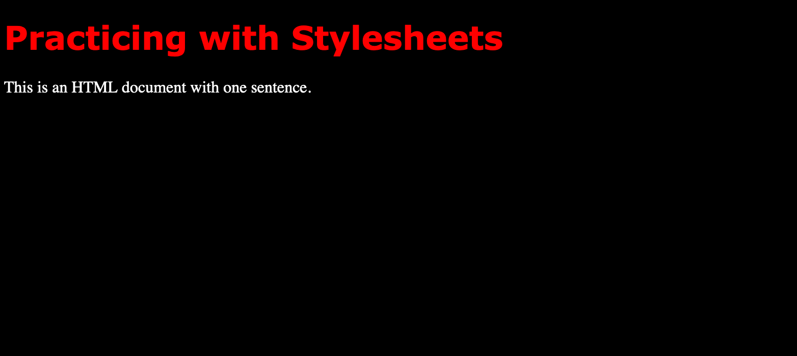

# CSS Basics

**Cascading Style Sheets**&mdash;CSS for short&mdash;provide a powerful means of formatting the content of an HTML document or even an entire website. By separating formatting specifications from our markup, we gain the ability to make global adjustments to the appearance of our web pages without having to alter the markup itself.

Why "cascading"? Because we can specify formatting at multiple removes from the markup to be styled. Style instructions that are closer to the affected markup supersede instructions at the next-farthest remove, and so on up the hierarchy. As a result, we can specify a set of global instructions that will govern multiple documents, fine-tune these instructions as needed for a particular document, further tune those document-level instructions for particular sections of a document, and, finally, override instructions at any of these levels with specific instructions attached to a single element in one location within the document. In addition, we can specify how content within a particular element&mdash;say, `<p>`&mdash;will be formatted in different contexts by defining different style **classes**. Content in a `<p>` that belongs to one class (assigned to it using the **class** attribute) will then appear different (in color, size, font, or any combination of these and other features) from content that belongs to another.

At each level of the cascade, if we want to make adjustments to styles set at the level above, we need only specify what will be *different* from that level; the other style instructions will still hold.

## Setting styles for a page

Let's begin by looking at how we might use CSS in a single web page. To do this, we're going to create a new practice file inside `~/critical-digital`. Use the text-editor of your choice to create the new practice file; if you've installed VS Code and its command-line tool, you can simply navigate to `~/critical-digital` and type:

```zsh
code practicing-stylesheets.html
```
Once the file opens in VS Code, save it before going any further. Then paste the following into the file:

```html
<!DOCTYPE html>
<html>
    <head>
        <title>Practicing with Stylesheets</title>
        <style>
            body {
                background-color: black;
            }

            h1 {
                color: red;
                font-family: verdana
            }

            p {
                color: white;
            }
        </style>
    </head>
<body>
    <h1>Practicing with Stylesheets</h1>

    <p>This is an HTML document with one sentence.</p>            
</body>
</html>
```
Save again, then open `practicing-stylesheets.html` in a browser. You should see this.



Notice that the visible content of this file is marked up with HTML elements that you used in your earlier practice file: `<body>`, `<h1>`, `<p>`. Those tags don't say anything about what font should be used for these elements, what color the font should be, or what the body's background color should be. That information is all contained within `<style>`, which lives inside `<head>`, where it's a sibling of `<title>`.

Of course, the body of your earlier practice file had a background color (most likely white), and your level-one heading and paragraph text had color (most likely black) and were in a particular font (most likely some version of Times). In the absence of style information set by you, the browser simply uses its default style settings.

Imagine if you *did* have to specify style information, such as font and color, inside every `<p>` element of a document containing even just a dozen or so paragraphs. And imagine having to go into every one of those `<p>` elements if you decided, at some point, that you wanted all your paragraph text to be in, say, Gill Sans rather than Verdana, and some light shade of gray rather than white. It would be a lot of work, and you'd be bound to make a mistake somewhere, such as missing one of the paragraphs.

Using the syntax in our example (which will be explained in a later section), you can set styles for the other elements you used in your earlier practice file&mdash;such as ``, `<tr>`, and `<li>`&mdash;and a great many more.

But suppose you want *all but one* of your paragraphs to be white, and that one exception to be bright green? You can do that by setting an **inline style** for that one paragraph which will override the one set document-wide in `<style>`. That capacity to override at each level of the hierarchy from site to document to element is, again, what makes style sheets "cascading."

## Setting styles inline

Back in your new practice file (`practicing-stylesheets.html`), let's add a few more paragraphs. Paste the content below into the file.

```html
<p>The artist is the creator of beautiful things. To reveal art and
conceal the artist is art’s aim. The critic is he who can translate
into another manner or a new material his impression of beautiful
things.</p>

<p>The highest as the lowest form of criticism is a mode of autobiography.
Those who find ugly meanings in beautiful things are corrupt without
being charming. This is a fault.</p>

<p>Those who find beautiful meanings in beautiful things are the
cultivated. For these there is hope. They are the elect to whom
beautiful things mean only beauty.</p>

<p>There is no such thing as a moral or an immoral book. Books are well
written, or badly written. That is all.</p>

<p>The nineteenth century dislike of realism is the rage of Caliban seeing
his own face in a glass.</p>

```
Let's change the font color of that second-to-last paragraph. Edit it as follows:

```html
<p style="color:greenyellow;">There is no such thing as a moral or an immoral book. Books are well written, or badly written. That is all.</p>
```
Save the file and refresh your browser. You should see that bright green color applied to the second-to-last paragraph alone.

Again, the syntax for defining styles at every level will be covered in a later section.

## Setting styles site-wide