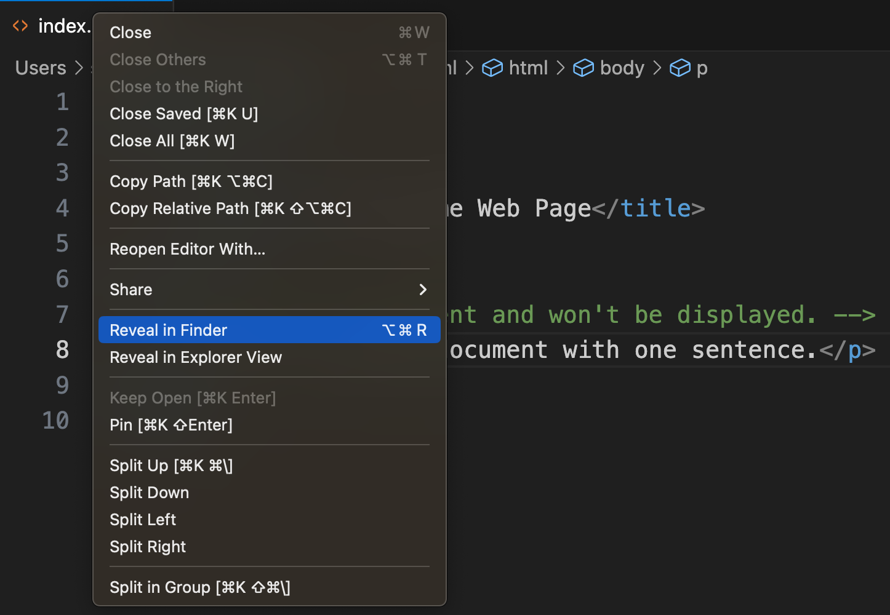
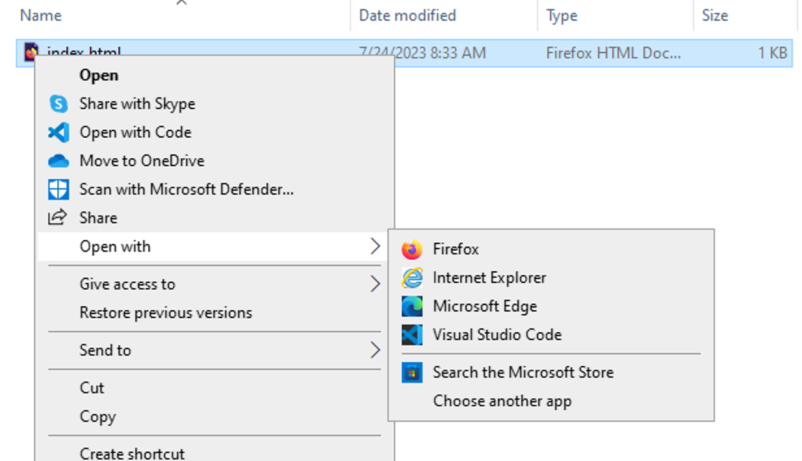

# HTML Basics

## Create an HTML file

Open a terminal window and navigate to the [folder you created in the command line module]({{ site.url }}/mod-2/creating-files-and-folders).

```zsh
cd ~/critical-digital
```
If you didn't create a folder with that name, or you've deleted it since completing the earlier module, create a new one.

```zsh
mkdir ~/critical-digital
```
The name of the folder isn't really important. If you prefer, you can give the folder a different name and swap that name in for `critical-digital` where necessary in the examples below. The location of the folder isn't really important, either. You could, for example, create your folder for this section inside `~/Documents`. The important thing is to take note of where your folder is so that you can navigate to it when you need to either from the command line or the GUI.

If you haven't already done so, navigate into the folder. Again, if the folder already exists, the command to do that is

```zsh
cd ~/critical-digital
```
Use `pwd` to make sure you're where you want to be. Ready? Now create and open a new file named `index.html` in your [text editor of choice]({{ site.url }}/mod-3/text-editors). If you're using [VS Code]({{ site.url }}/mod-3/text-editors#visual-studio-code), the command will be

```zsh
code index.html
```
Remember that the file will be lost until you save it at least once, so do that now with `cmd-S` (macOS) or `ctrl-S` (Windows).

Type or paste the following into your new file:

```html
<!DOCTYPE html>
<html>
    <head>
        <title>My Awesome Web Page</title>
    </head>
<body>
    <!-- This is a comment and won't be displayed. -->
    <p>This is an HTML document with one-sentence.</p>
</body>
</html>
```

Save the file.

## Open the file in a browser

Now let's see how your file looks in a browser. Navigate to the file in your GUI. If you're having difficulty locating it there, you can right-click on the file tab in VS Code and select "Reveal in Finder" (macOS) or "Reveal in File Explorer" (Windows).

  
*Right-click the file tab in VS Code to reveal the file's location in Finder or File Explorer*

You may be able to open the file in your system's default browser by simply double-clicking it. If that doesn't work&mdash;if the file opens in a text editor, for example&mdash;try right-clicking the file in your GUI and choosing "Open with" from the context menu that pops up. Then select the browser in which you'd like to open the file.



The result will look pretty bare bones: The sentence, "This is an HTML document with one-sentence" looking rather lonely in the upper left of your browser window, probably in the Times font, on a white background.

Notice that the address in your browser's location bar doesn't begin with `http://`  or or `https://` but with `file://`, and that the rest of the address is simply the path to the file on your machine. We saw the same thing before when ...

Notice that this bit of your file is nowhere to be seen:

```html
<!-- This is a comment and won't be displayed. -->
```
That's because your markup has identified this bit as a comment, so&hellip;it won't be displayed.

Notice also that the text you put in the `<title>` element shows up, not within your document, but in the browser tab or title bar. Your document's "title" isn't part of the document at all; it's information *about* your document, also known as **metadata**.

## Edit the document

It might be nice to put some kind of title or heading in the document itself. Let's do that.

Go back to your text editor and add an `<h1>` element above your `<p>` element to insert a level-one heading, like so:

```html
    <h1>My Awesome Web Page</h1>
    <p>This is an HTML document with one-sentence.</p>
```
Save the file again, go back to your browser, and refresh your browser view to see the change take effect. (If you don't see the change on refresh, double-check that you've saved your changes to the file. Your changes won't show up until they've been saved.)

## Empty spaces

Go back to your text editor again and toss some random spaces and an empty line into your file. Put your cursor at the end of the word "document" and hit your `return` key. You should have something like this:

```html
    <h1>My     Awesome  Web Page</h1>

    <p>This is an HTML document 
        with one-sentence.</p>
```

Save the file and refresh your browser. This time, you shouldn't see any change at all to what the browser displays.

Why not? In general, browsers ignore empty spaces, empty lines, and line breaks in HTML. They don't ignore the spaces between individual words, of course. But if you type two consecutive spaces&mdash;perhaps because you're used to doing that after a period, before the beginning of the next sentence&mdash;the browser will ignore the second space. It will also ignore space you enter using the tab key.

This gives you a lot of freedom to format your HTML in a way makes it maximally readable to you for editing. But it also mean that you can't you use the space bar, tab key, or return key to change how your text is formatted in the browser. Don't worry. There are ways to do that.

## Nesting

Structure is important in HTML. A basis structural principle is that elements can't overlap. For example, the following isn't valid HTML and won't display properly in your browser:

```html
<h1>My Awesome <p>Web</h1>page</p>
```
However, you can "nest" one element inside another as long as both the opening and closing tags of the inner element are inside the opening and closing tags of the outer one. As you've already seen, both your `<head>` and `<body>` elements are nested within your document's outermost element, `<html>`. 

The `<html>` element is your document's **root** element. Both `<head>` and `<body>` live independently inside the root (neither nested within the other) at the same level. We say that they're both **children** of the root element. That means they're **siblings** to one another.

Our `<body>` element has two children of its own at this point, `<h1>` and `<p>`. (Don't be confused by the fact that in both the text editor and the browser, our paragraph \[in `<p>`\] is visually beneath our heading \[in `<h1>`\]). In the document structure they're nevertheless at the same level; that is, siblings.

Let's do some more nesting by making a couple of &hellip;

## Lists

To make a list, you'll need to nest multiple list-item elements (`<li>`) within an enclosing element: `<ul>` for a simple, unordered list, say, or `<ol>` for an ordered list. Add the following near the bottom of your `index.html` file (above your closing `</body>` tag).

```html
<h2>Things to buy</h2>
<ul>
    <li>Beans</li>
    <li>Corn</li>
    <li>Squash</li>
</ul>
```
It's common to indent nested elements like the `<li>` elements here for readability, but as explained above, it isn't necessary.

Go head and add the following beneath your unordered list:

```html
<h2>Steps to take</h2>
<ol>
    <li>First, do this.</li>
    <li>Next, do the other thing.</li>
    <li>Finally, do the last thing.</li>
</ol>
```
Is it possible to nest a list inside a list? Absolutely! Go ahead and paste the following into your document.

```html
<h2>Things to do for my trip</h2>
            <ul>
                <li>Buy clothes</li>
                <li>Buy food
                    <ul>
                        <li>Beans</li>
                        <li>Corn</li>
                        <li>Squash</li>
                    </ul>
                </li>
                <li>Buy batteries</li>
            </ul>
```
Refresh the browser and see what you get. 

How does this work?

Inside our second list item&mdash;"Buy food"&mdash;we've nested a whole new list, with its own three list items. This example illustrates the value of indenting your HTML to keep it readable. The closing `</li>` tag for "Buy food" is at the same indentation level as the opening one, and the `<ul></ul>` tags for the nested list of food items are further indented and vertically aligned with each other.

## Format and meaning

By default, your browser renders your level-one headings at one font size, your level-two headings at a small font-size, and your paragraph text at a smaller size still. It makes your headings bold, too. It uses bullet points for unordered lists and arabic numerals for ordered ones. It changes up the bullet type for a list nested within a list.

These default formatting choices can all be altered, and a later section, when we take up CSS (Cascading Style Sheets), you'll see how.

If you step back for a moment from the question of appearance, you can recognize that your tags are actually *saying* something. They're semantic; that is, they have meaning. It's a different kind of meaning from that of the text inside the tags; it's meaning *about* that text. An `<h1>`
tag declares, about the text inside it, "👋 I'm a level-one heading!" (Another way to put this, then, is to say that the tag is *declarative*.)

The declarative aspect of markup is important for a number of reasons. One of the most important of these is **accessibility**. A blind or visually impaired person using a screen reader to read your web page can't rely on cues such as font size, font weight (bold or normal), or bullets to know whether text belongs to a heading, a paragraph, or a list. But the screen reader can enable to them to distinguish these different kinds of text by parsing your markup.

To ensure that your web content is accessible, you should never use formatting itself to signal structure. Styling the text inside a `<p>` tag to make it large and bold doesn't *say* what `<h1>` or `<h2>` says and is of no use to someone counting on your markup to be usefully declarative.

## Bold and italic text

Let's say you want some of the text on your web page to appear in **boldface** font and some text be to appear in **italic**.

```html
<p>This text will be <strong>bold</strong>.</p>
<p>This text will be <em>italic</em>.</p>
```
Here we've nested two elements, `<strong>` and `<em>` respectively, each within a `<p>`.

In web pages written in earlier versions of HTML, it's common to see text styled in bold by using the `<b>` tag and text styled in italic using `<i>`. These tags still worked, but they've been **deprecated** by the World Wide Web Consortium (W3C). Consider the difference between the deprecated tags and the ones that have replaced them: `<b>` and `<i>` are *merely* formatting instructions; they have little if any semantic content. By contrast, `<strong>` says, "This text is of strong importance," while `<em>` says, "This text is being emphasized." Bold formatting for `<strong>` and italic formatting for `<em>` are, like the font sizes and weights of headings, simply default browser settings. In fact, we can tell the browser, using CSS, to format them in whatever way best suits our purpose.

## Block and inline elements

The `<strong>` and `<em>` elements are examples of **inline** elements. Inline elements display in the same line of text as their enclosing elements.

By contrast, a **block** element begins on a new line. Try adding this to your `index.html` file:

```html
<p>This is a paragraph. </p><p>This is another paragraph.</p>
```
Save the file and refresh your browser. Though you typed (or pasted) a single line of text into your file, your two paragraphs will still display with an empty line between them.