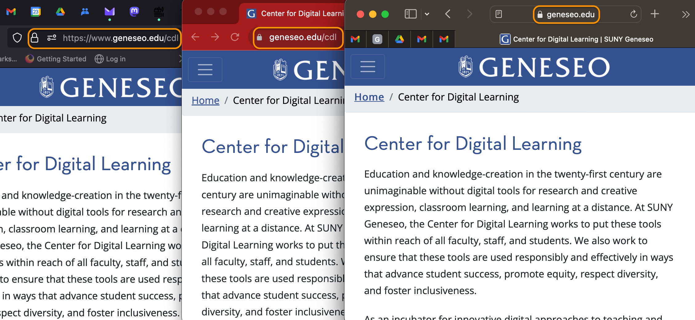
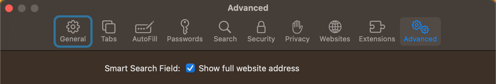

# HTTP and URL

Open your browser of choice and, in the browser location bar, type or past this URL:

`https://geneseo.edu/cdl`

If you're connected to the internet, your browser should take you to the landing page for the SUNY Geneseo Center for Digital Learning.

Depending on the operating system, your browser, and your browser settings, the address displayed in the location bar after the page loads will vary. Here are three renderings of the URL on a Mac in three different browsers: from left to right, Firefox, Chrome, and Safari.

  
*The landing page URL for the Geneseo CDL as it appears in three different browsers*

Despite this variation, in all three cases your browser has sent a **request** for a file on a server whose **domain name** is `geneseo.edu`. Your request, and the file that the server has delivered in response, have used the communication protocol that was part of Tim Berners-Lee's [original conception of a "world wide web"]({{ site.url }}/mod-4/what-is-the-web#birth-of-the-web): the **Hypertext Transfer Protocol**, abbreviated **HTTP**.

In all three cases, the same file has been delivered, a plain-text file using the **markup language** we [looked at earlier]({{ site.url}}/mod-3/kinds-of-text#html), **Hypertext Markup Language**, or **HTML**, short. HTML, too, was part of Berners-Lee's original conception.

Berners-Lee originally used the term **URI** for the address to which a browser is pointed, short for **Uniform Resource Indentifier**. This term is still used as a generic name for several different types of addresses, names, or objects that may live on the web. A URL&mdash;short for **Uniform Resource Locator**&mdash;is one type of URI.

One important improvement to HTTP since its inception is the added capability of encryption. Communications over **HTTPS** (Hyptertext Transfer Protocol Secure) are encrypted in transmission using **TLS** (transport layer security), preventing eavesdroppers on a network from reading the transmitted data. The lock icon you see in all three browsers pictured above indicates that the browser's connection with the geneseo.edu server is secure. In addition, because the browser is able to read and verify a certificate signed by a trusted [certificate authority](https://www.computerhope.com/jargon/c/certificate-authority.htm), you can have a high degree of confidence that the site is the one you intended to visit, not an impostor. Clicking the lock icon in any of the browsers gives you the option to learn more about the site's certificate.

Increasingly, browsers drop the `http://` or `https://` from the front of the URL as they display it in the location bar, and both browsers and servers may omit the `www` (for "world wide web") in the domain name. Most browsers now helpfully warn you if your connection is not over `https` or the site you're visiting lacks a valid certificate.

By default, Safari also hides the full URL you're visiting, showing only the domain name. In our example,while Firefox and Chrome inform you that you're vising `geneseo.edu/cdl`, Safari shows only `geneseo.edu` and will continue to do so as you move from page to page on the Geneseo website. Fortunately, you can adjust this setting, though Apple doesn't make it easy. If Safari is your browser of choice, then at least when using it with this course, you should go to Safari > Settings > Advanced and check the box next to "Show full website address."

  
*Check the box to make Safari show full URLs*

