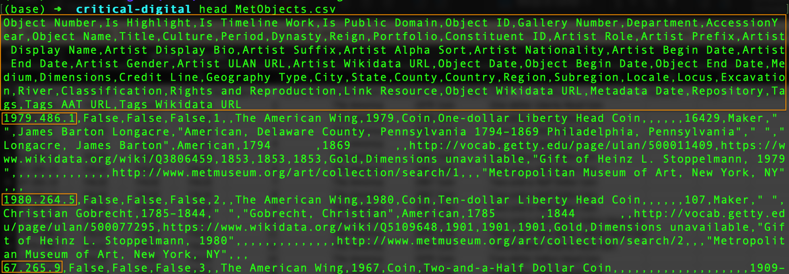
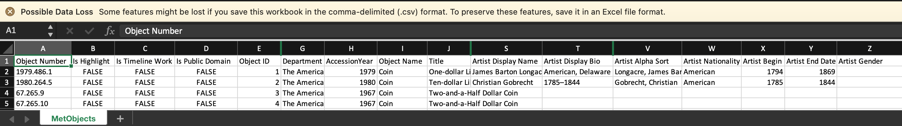

# Collecting and Using Data

Work with data commonly comprises five steps:

1. Collection
2. Processing or transformation 
3. Cleaning
4. Analysis
5. Visualization

Often, our work begins with a research question or hypothesis. We hope that **collecting** and analyzing relevant data will enable us to answer the question, or either confirm or disconfirm the hypothesis. The data as it initially comes to us (perhaps through our own observations, perhaps as reported by someone else) is said to be "raw" until it has been **processed** or **transformed** to put it in a form amenable to analysis and **"cleaned"** so as to eliminate irregularities, inconsistencies, gaps, and other issues that might impede analysis or throw off our results. Our **analysis** of the cleaned data may involve operations such as counting recurrences or calculating a mean or median in a set of numerical values. Finally, representing the results of our analysis in a **visualization** such as a graph or chart may help us better understand those results and communicate their significance effectively to others.

## An example

An example project reflecting the process above might look like this:

- **Research question:** What proportion of the artwork collected and/or hosted by the Metropolitan Museum of Art was created by non-cis-gender male artists **and** is in the public domain?
- **Data collection:** The museum has shared an [open access data set](https://github.com/metmuseum/openaccess) that might provide an answer to this question if it includes **variables** corresponding to gender and copyright. (To follow the rest of this example, it's not necessary to download the data set, which is in a file named `MetObjects.csv` that's quite large at over 300 MB. If you'd like to download it, however, you can visit [this page](https://github.com/metmuseum/openaccess/blob/master/MetObjects.csv) and click the download button at far right to "Download raw file.")
- **Transformation and cleaning:** If "gender" and "copyright" are included in some form as variables in the data set, it will be important to determine that the **values** assigned to these variables are named consistently across the data. For example, if "cis-male," "cisgender-male," and "c-male" are all used in different places to name the same value, the data will have to be cleaned to replace these differing names with a single, consistent one. In addition, if information about copyright or artist's gender is simply missing for some works, a decision will have to be made about how to handle these cases in our analysis. If the data has been recorded in a minimally structured, plain text format, cleaning will be easier if we first transform the data into a format we can work with more easily, such as a spreadsheet or a data object that we can manipulate in a programming language such as [Python](https://pandas.pydata.org/) or [R](https://www.r-project.org/). 
- **Analysis:** Answering the question will require counting the number of works in the data set that meet both of our **conditions** (created by non-cis-gender males, in the public domain) and dividing that number by the total number of works in the data set.
- **Visualization:** The result of the analysis will be a decimal or a percentage. The significance of this number may be easier to appreciate if the result is presented in the form of a pie chart.

The Metropolitan Museum's data is provided in a [plain-text file format]({{ site.url }}/mod-3/kinds-of-text) that you encountered earlier: Comma Separated Values or "CSV" for short. That means we can peek into the file from the command line and get a quick sense of what's in there. Earlier, you learned that you can look inside plain text files from the command line using `cat` or `less`. Another command, `head`, can be used to see just the first few lines of a file&mdash;a handy alternative when the file is very large.

  
*Viewing the first few lines of the csv file using the head command*

The lines of this file are very long, so our terminal window has wrapped them. We can easily make out, however, that the first line consists of a series of **variable** names. The first variable is named "Object Number" and the last is named "Tags Wikidata URL".

In each of the lines that follow, we see a **record** or **observation** in the data set; that is, the **values**, for each object in the Met's collection included in the data set, that correspond to the variables in the first line. Scanning down the left side of the terminal window, we can quickly pick out what appear to be the values corresponding to "Object Number" for the first few records in the data set: "1979.486.1", "1980.264.5", "67.265.9".

Looking at the first line again, we see the variables "Is Public Domain" and "Gender". Promising! The data set might help us answer our question. It's worth a closer look, but going further will be difficult while viewing the data in this format.

Spreadsheet applications such as Excel, Google Sheets, and the free and open source [LibreOffice Calc](https://www.libreoffice.org/discover/calc/) will open CSV files, which can then be **transformed** into the application's own file format (e.g., `.xlsx` for Excel) and saved in that format. In the screenshot below of the data as viewed in Excel, some columns have been hidden so that the ones we care about will be included.

    
*Viewing the first few lines of the same data in Excel. Click to enlarge.*

In the spreadsheet view, each **column** is identified by a letter or combination of letters (A, B, C, &hellip;) and each **row** by a number (1, 2, 3, &hellip;) Row 1 is occupied by our variables. Each subsequent row represents a record or observation. The value of a given variable for a particular record/observation appears in a cell at the intersection of column and row. We can locate these values using column letters and row numbers: for example, the value of "AccessionYear" for the first record is found in cell H3. The value is "1980".

It looks like there's a good chance that our data set consistently uses "TRUE" and "FALSE" as the values for the variable "Is Public Domain". Great! But no value at all is provided for the variable "Gender" in the first few records. And if we probe further by scrolling down through the spreadsheet, we find that the values are all in the form of one or more pipe symbols (`|`) and one or more instances of "Female". Understanding what the data are telling us about the gender identities of the artists in the collection, let alone putting the information into a form that will facilitate analysis, will be challenging if not impossible.

We may have to seek clarifying documentation from the museum about its system for representing artists' gender identities in the data set, or we may have to seek other data to find an answer to our question. Or, for now at least, we may not be able to answer the question at all.

Working with data is frequently an iterative process in which we must change our strategy for finding answers repeatedly until we succeed&mdash;or make the decision to move on to another question.