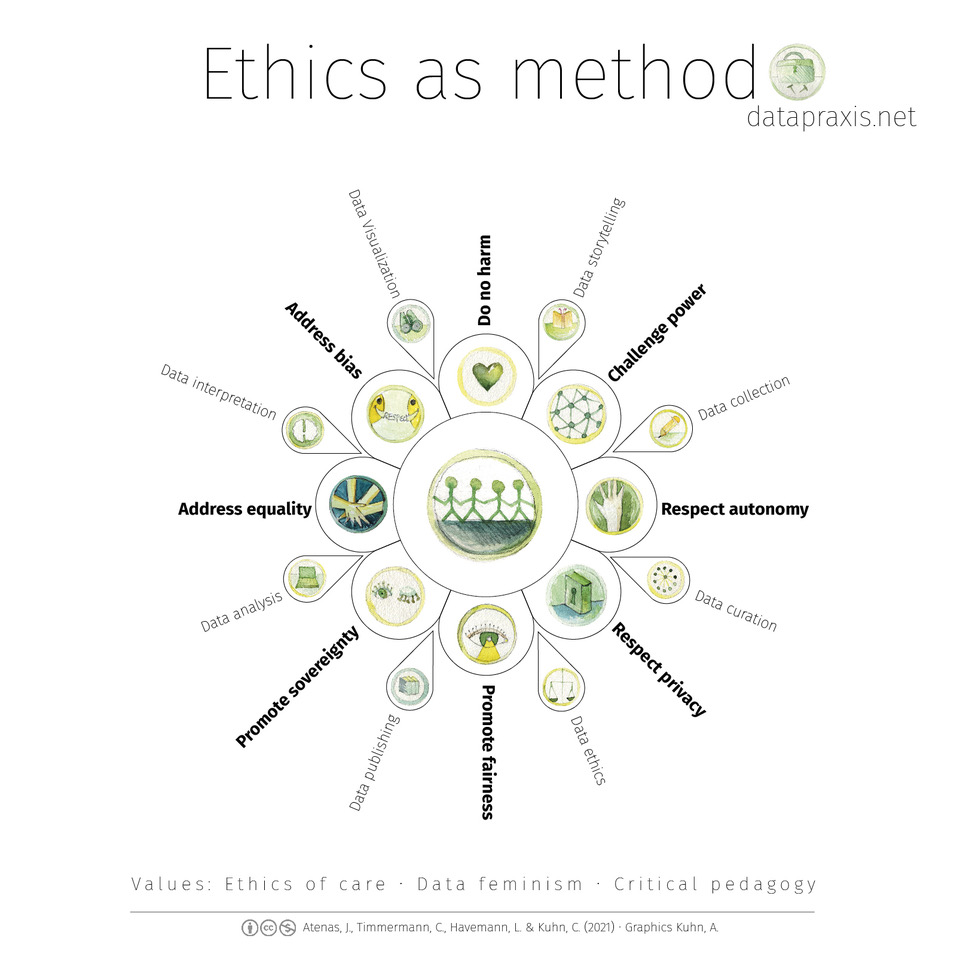

# Data Ethics

> Today, data science is a form of power. It has been used to expose injustice, improve health outcomes, and topple governments. But it has also been used to discriminate, police, and surveil. This potential for good, on the one hand, and harm, on the other, makes it essential to ask: Data science by whom? Data science for whom? Data science with whose interests in mind? The narratives around big data and data science are overwhelmingly white, male, and techno-heroic.

These words on the home page of *Data Feminism*, by Lauren Klein and Catherine D'Ignazio, published by MIT Press and [available online](https://data-feminism.mitpress.mit.edu/) in an open access edition, succintly articulate the current state of data science, three key questions we must ask to evaluate the ethical status of any given use of that science, and a major obstacle to ensuring that the practice of that science is equitable and non-discriminatory, while serving humane ends.

We are all awash in data, producing much of it ourselves through the computerized devices that have become an indispensable part of our daily lives. Data scientists can use this information to [yield fascinating insights](https://ourworldindata.org/) into nature and society. And data science methods can be used by humanists to produce fresh perspectives on [literature](https://culturalanalytics.org/article/11035) or [history](https://enslaved.org/) from newly discovered or newly organized  data from the past.

At the same time, [questionable if not downright illegal uses of data by big tech firms](https://en.wikipedia.org/wiki/Facebook%E2%80%93Cambridge_Analytica_data_scandal), the explosive growth of [data-driven targeted advertising](https://www.nytimes.com/2020/01/24/opinion/sunday/surveillance-capitalism.html), revelations of "algorithmic injustice" in [facial recognition](https://www.nytimes.com/2019/12/19/technology/facial-recognition-bias.html) and [other artificial intelligence-driven technologies](https://themarkup.org/series/machine-learning), and ethical issues surrounding the [use of copyright-protected materials by generative AI tools](https://theconversation.com/generative-ai-is-a-minefield-for-copyright-law-207473) such as ChatGPT, Dall-E, Midjourney, and Stable Diffusion have led to calls for legislation, regulation, and research frameworks aimed at preventing or mitigating harms to individuals and groups that result from invasive, discriminatory, or other unethical practices in the collection, analysis, publication, or algorithmic use of data.

## What you can do as a generator of data

As a data-generator, aka a citizen, your best first step to protecting yourself from unethical data collection and use&mdash;as unnecessarily burdensome and tedious as it may be&mdash;is probably to read the terms and conditions, and privacy policies, of websites you visit, applications you run, and services to which you subscribe. [Being aware can make a difference](https://themarkup.org/hello-world/2023/08/12/this-is-what-happens-when-people-start-actually-reading-privacy-policies).

You can also make a point of using a privacy-oriented search engine such as [Duck-Duck-Go](https://duckduckgo.com/about) and a browser extension, such as [Privacy Badger](https://www.eff.org/pages/privacy-badger), that can both reveal and block technologies that track you across the web.

Finally, you can make a practice of applying the three questions at the top of this page to every business, research, or governmental use of data you encounter: Who's collecting and using this data? Who is benefiting from its collection and use? Whose interests are being served? And a fourth question: What can I do to help ensure that both the uses and "narratives around big data and data science" better reflect the diverse identities and diverse interests of a democratic society?

## What you can do as a user of data

If you're collecting and working with other people's data, for research or other purposes, you should make it your business to familiarize yourself with ethical principles that have been developed by, among others, governments, institutions, and professional bodies. The US federal government, for example, has published this [data ethics framework](https://resources.data.gov/assets/documents/fds-data-ethics-framework.pdf) (pdf). Columbia University computer scientist Jeannette M. Wing uses the acronym [FATES](https://datascience.columbia.edu/news/2018/data-for-good-fates-elaborated/) to describe a similar framework that highlights Fairness, Accountability, Transparency, and Ethics.

Some common threads in these frameworks include respecting the legal rights, safety, and security of those whose data you use or who will use what you create with your data; recognizing that biased data will produce bias in any model or tool built with the data; being accountable for your work and what comes out of it; and being honest and transparent about your methods and purposes.

The graphic "Ethics as method," reproduced below from website of the project [understanding DATA praxis + politics](https://datapraxis.net/1005-2/), captures some of these threads and more.

  
*Ethics as method, licensed [CC-BY-NC](https://creativecommons.org/licenses/by-nc/4.0/)*

## The case for open data

Data needn't always be open to be ethical. In fact, it would clearly be *unethical* to make many types of data open. But at least when it comes to scientific data, there's a case to be made that whenever we can make it open ethically, we should. [PLOS, the Public Library of Science](https://plos.org/open-science/open-data/), defines open data this way:
    
> Open Data is a strategy for incorporating research data into the permanent scientific record by releasing it under an Open Access license. Whether data is deposited in a purpose-built repository or published as Supporting Information alongside a research article, Open Data practices ensure that data remains accessible and discoverable. For verification, replication, reuse, and enhanced understanding of research.

As the PLOS page on open data goes on to explain:

- Proactively sharing data ensures that your work remains **reproducible** over the long term.
- Sharing data demonstrates rigor and signals to the community that the work has integrity, inspiring **trust**.
- Making data public opens opportunities to get academic **credit** for collecting and curating data during the research process.
- Posting datasets in a repository or uploading them as Supporting Information prevents data loss, helping to **preserve the scientific record**.