# Data Visualization

Visualization is a powerful way to tell a story with your data. 

W.E.B. Du Bois' [data portraits](https://www.loc.gov/pictures/search/?q=%22lot%2011931%22%20NOT%20medal&st=grid&co=anedub&loclr=blogpic) included in the [the Exhibit of American Negroes](https://en.wikipedia.org/wiki/The_Exhibit_of_American_Negroes_) at the Paris Exhibition of 1900 illustrate the power of effective visualization. With compelling hand-drawn graphics, Du Bois tells the story of what it means to be Black in post-Emancipation America as he translates sociological research and census data to reach beyond the academy. On the arts website [Hyperallergic](https://hyperallergic.com/), Jasmine Weber has described ["How W.E.B. Du Bois Meticulously Visualized 20th-Century Black America."](https://hyperallergic.com/476334/how-w-e-b-du-bois-meticulously-visualized-20th-century-black-america/)

Different types of visualization work best for different types of analysis. The table below, reproduced from the CUNY DHRI-Curriculum GitHub repository ["Data Literacies,"](https://github.com/DHRI-Curriculum/data-literacies) (licensed [CC-BY-SA](http://creativecommons.org/licenses/by-sa/4.0/)), offers some examples.

<table>
    <tr>
        <th>Type of Analysis</th>
        <th>Type of Visualization</th>
         <th>When to Use</th>
        <th>Example of Visualization</th>
    </tr>
    <tr height="300px">
        <th rowspan="3">Comparison</th>
         <td>Bar chart</td>
         <td>Comparison across distinct categories</td>
        <td><a href="https://cdl-geneseo.github.io/critical-digital-practices/assets/D4PG_bar.png">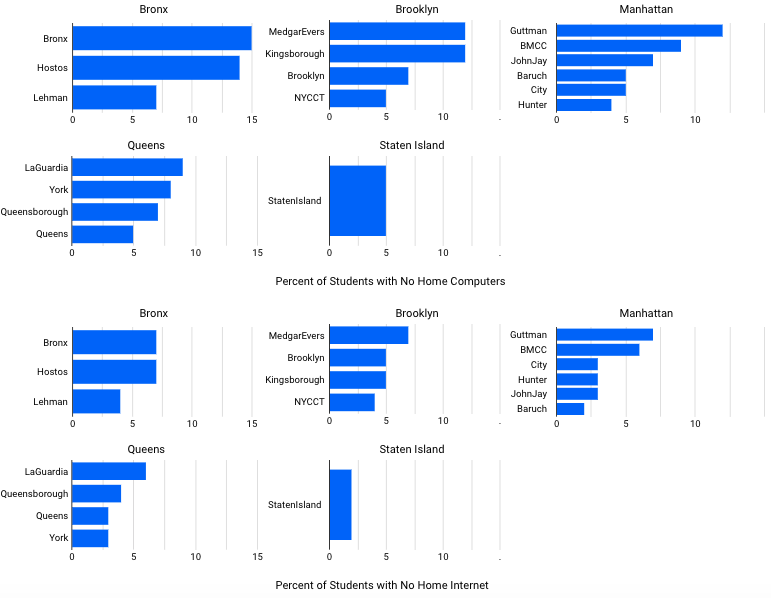</a><figcaption>Source: <a href="https://dataforgood.commons.gc.cuny.edu/report-on-covid-19s-impact-on-cuny-students/" target="_blank">Data for Public Good</a> at the CUNYGraduate Center</figcaption></td>
    </tr>
    <tr height="300px">
        <td>Histogram</td>
        <td>Comparison across continuous variable</td>
        <td><a href="https://cdl-geneseo.github.io/critical-digital-practices/assets/PolicyViz_histogram.png" >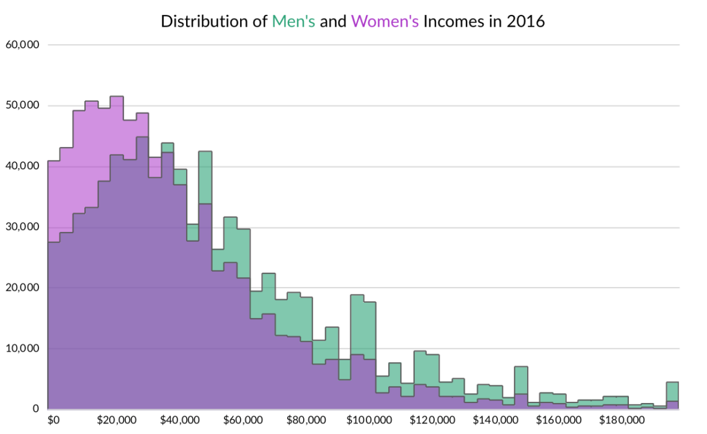</a><figcaption>Source: <a href="https://policyviz.com/2018/11/27/histogram-design-decisions/" target="_blank">Policy Viz</a></figcaption></td>
    </tr>
    <tr height="300px">
        <td>Scatter plot</td>
        <td>Useful to check for correlation (not causation!)</td>
        <td><a href="https://cdl-geneseo.github.io/critical-digital-practices/assets/538_scatter.png">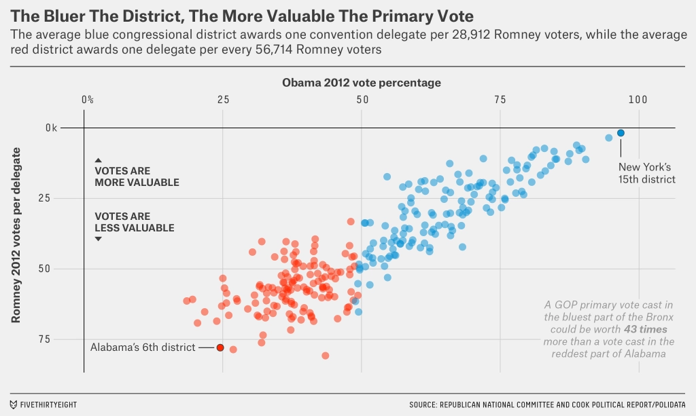</a><figcaption>Source: <a href="https://fivethirtyeight.com/features/the-gops-primary-rules-might-doom-carson-and-cruz/" target="_blank">FiveThirtyEight</a></figcaption></td>
    </tr>
    <tr height="300px">
        <th rowspan="3">Time</th>
        <td>Stacked area chart</td>
        <td>Evolution of value across different groups</td>
        <td><a href="https://cdl-geneseo.github.io/critical-digital-practices/assets/DatatoViz_stackedarea.png">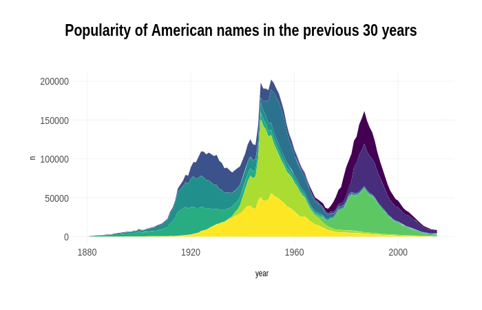</a><figcaption>Source: <a href="https://www.data-to-viz.com/graph/stackedarea.html" target="_blank">From Data to Viz</a></figcaption></td>
    </tr>
    <tr height="300px">
        <td>Sankey Diagram</td>
        <td>Displaying flows of changes</td>
        <td><a href="https://cdl-geneseo.github.io/critical-digital-practices/assets/DatatoViz_sankey.png">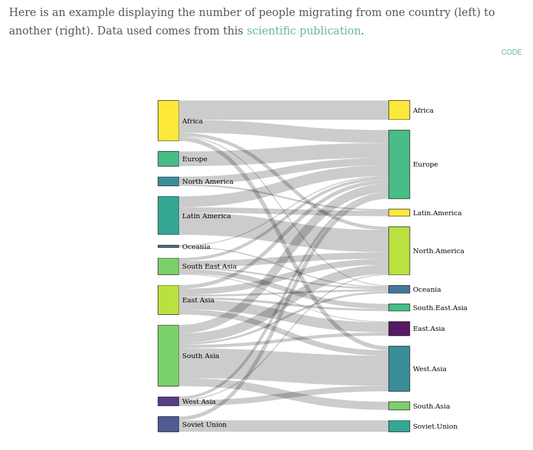</a><figcaption>Source: <a href="https://www.data-to-viz.com/graph/sankey.html" target="_blank">From Data to Viz</a></figcaption></td>
    </tr>
   <tr height="300px">
        <td>Line graph</td>
        <td>Tracking changes over time</td>
        <td><a href="https://cdl-geneseo.github.io/critical-digital-practices/assets/D4PG_line.jpg">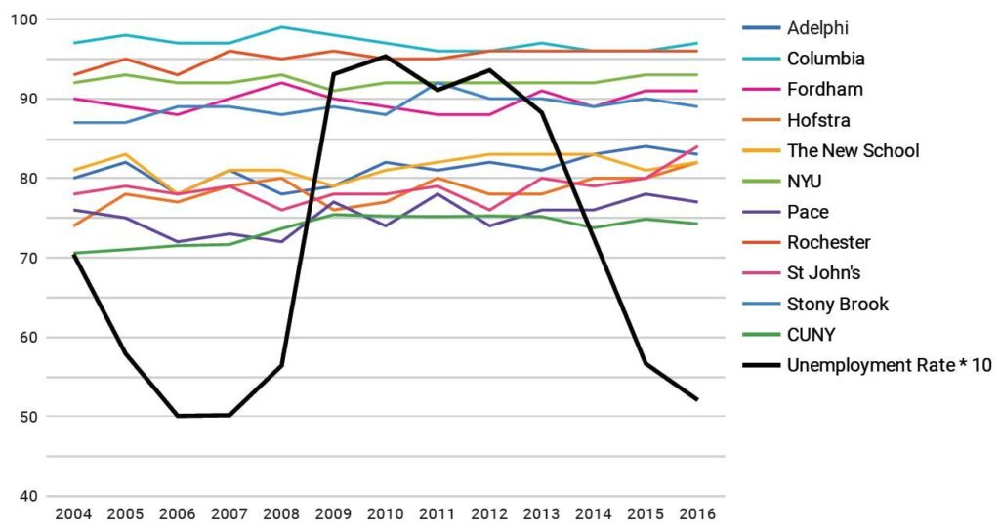</a><figcaption>Source: <a href="https://dataforgood.commons.gc.cuny.edu/report-on-covid-19s-impact-on-cuny-students/" target="_blank">Data for Public Good</a> at the CUNY Graduate Center</figcaption></td>
    </tr>
    <tr height="300px">
        <th rowspan="2">Small numbers/percentages</th>
        <td>Pie chart</td>
        <td>Demonstrate proportions between categories</td>
        <td><a href="https://cdl-geneseo.github.io/critical-digital-practices/assets/DB_pie.jpg">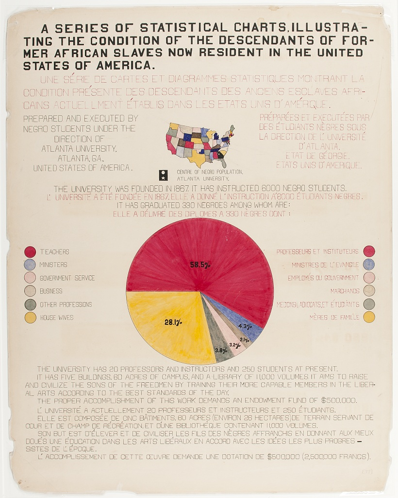</a><figcaption>Source: <a href="https://www.loc.gov/pictures/search/?q=%22lot%2011931%22%20NOT%20medal&st=grid&co=anedub&loclr=blogpic" target="_blank">Library of Congress</a></figcaption></td>
    </tr>
    <tr height="300px">
        <td>Tree map</td>
        <td>Demonstrate hierarchy and proportion</td>
        <td><a href="https://cdl-geneseo.github.io/critical-digital-practices/assets/DataViz_treemap.png">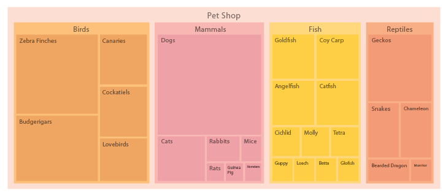</a><figcaption>Source: <a href="https://datavizcatalogue.com/methods/treemap.html" target="_blank">The Data Visualization Catalogue</a></figcaption></td>
    </tr>
    <tr height="300px">
        <th rowspan="2">Survey responses</th>
        <td>Stacked bar chart</td>
        <td>Compares total amount across each group (e.g. plotting Likert scale)</td>
        <td><figcaption>Source: <a href="https://www.loc.gov/pictures/search/?q=%22lot%2011931%22%20NOT%20medal&st=grid&co=anedub&loclr=blogpic" target="_blank">Library of Congress</a></figcaption></td>
    </tr>
    <tr height="300px">
        <td>Nested area graph</td>
        <td>Visualize branching/nested questions</td>
        <td><a href="https://cdl-geneseo.github.io/critical-digital-practices/assets/evergreen_nestedarea.jpg">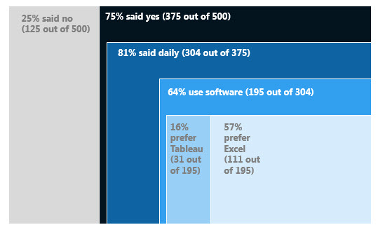</a><figcaption>Source: <a href="https://stephanieevergreen.com/nested-area-graph/" target="_blank">Evergreen Data</a></figcaption></td>
    </tr>
    <tr height="300px">
        <th rowspan="2">Place</th>
        <td>Choropleth map</td>
        <td>Visualize values over a geographic area to demonstrate pattern</td>
        <td><a href="https://cdl-geneseo.github.io/critical-digital-practices/assets/DB_choropleth.jpg">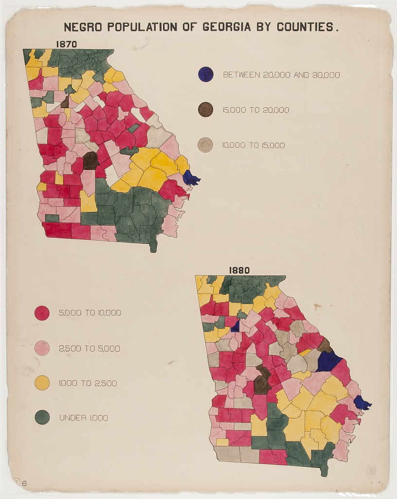</a><figcaption>Source: <a href="https://www.loc.gov/pictures/search/?q=%22lot%2011931%22%20NOT%20medal&st=grid&co=anedub&loclr=blogpic" target="_blank">Library of Congress</a></figcaption></td>
    </tr>
    <tr height="300px">
        <td>Hex(bin) or Tile map</td>
        <td>Similar to Choropleth with the hexbin/tile representing regions equally rather than by geographic size</td>
        <td><a href="https://cdl-geneseo.github.io/critical-digital-practices/assets/rgraph_hexbin.png" >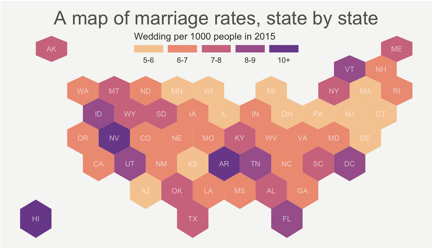</a><figcaption>Source: <a href="https://www.r-graph-gallery.com/328-hexbin-map-of-the-usa.html" target="_blank">R Graph Gallery</a></figcaption></td>
    </tr>
    <tr>
        <th colspan="4"> Adapted from <a href="https://us.sagepub.com/en-us/nam/effective-data-visualization/book265203_"> Stephanie D. Evergreen (2019) Effective data visualization: The right chart for the right data</a>, <a href="https://datavizcatalogue.com/">The Data Visualization Catalogue</a>, and <a href="https://www.data-to-viz.com/">From Data to Viz</a>.</th>
    </tr>
</table>