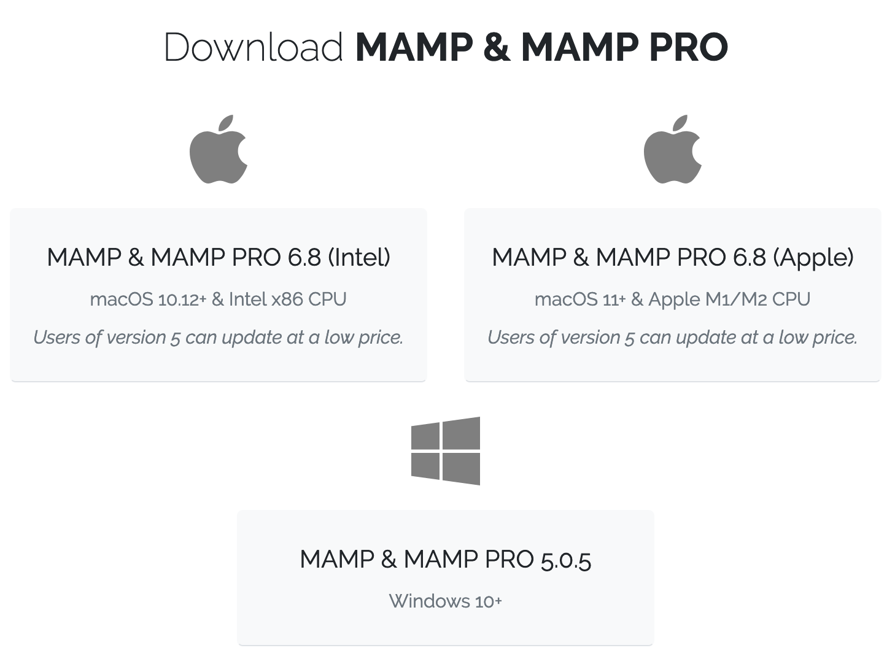

# Installing MAMP

Go to [https://mamp.info](https://mamp.info) and download the version appropriate to your operating system and CPU. (If necessary, refresh your memory as to [how to find system information]({{ site.url }}/mod-1/os) about your machine.) After running the installer, you'll end up with both MAMP and MAMP Pro. You can ignore MAMP Pro if you don't intend to upgrade for a fee. You can use MAMP, the free version, indefinitely.

The [MAMP documentation](https://documentation.mamp.info/) explains the installation process in detail. It also explains how to upgrade MAMP, when a new version is released, without losing the data you've added to your existing installation, as well as how to uninstall the application if you no longer want it on your machine. ***You should review this documentation now, before moving forward with your installation.***

You'll want to keep the default settings in place for preferences such as "Name", "Document root", and "Web server". The preference you're most likely to want to change, at some point in the future, probably more than once, is "Document root." We'll get to why in a bit.

## Starting up

After installing the software, fire up MAMP and, as explained in the documentation under "First Steps," click the "Start" button (Windows: "Start Servers") to start the Apache and MySQL servers. Once the servers are running, open the WebStart page (Windows: Start page).

A new tab will open in your default browser window at the address `localhost:8888` or similar. MAMP is serving pages just as a server on a remote web host would do, but instead of serving them to an IP address on the open web, it's serving them to an address local to your machine, `127.0.0.1`, for which `localhost` is the human-friendly equivalent. Specifically, it's serving them via the network port 8888 (Mac) or 80 (Windows).

MAMP's start page will display or contain links to information about your PHP and MySQL installations. The latter uses its own port (8889 on Mac, 3306 on Windows). An important piece of information you'll see here is that the username and password for your MySQL server are both `root`. You should not alter them.

Finally, take note of where MAMP stores the files it serves for your WordPress, Omeka, or other locally developed website. On Mac, the default location is `/Applications/MAMP/htdocs`. On Windows, it's `C:\MAMP\htdocs`. As you'll soon see, you can run multiple websites from your `htdocs` folder, though with the basic setup we'll be using, you can only display one of those sites at a time.

## Shutting down

Launch your MAMP servers when you plan to work with them, and shut them down when you're done. If you leave them running between different sessions working at your computer, files could become corrupted. Quitting the application will shut down the Apache and MySQL servers. You can also shut the servers down manually from the application's main dialogue and leave MAMP itself running. One click in the main dialogue will start the servers back up when you're ready to use them again.