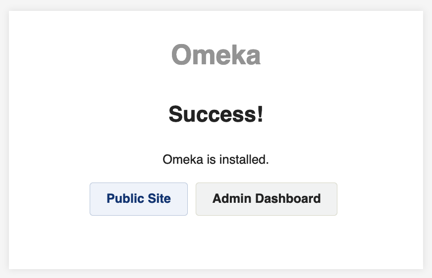
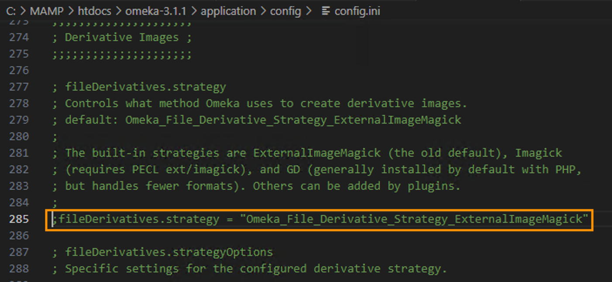

# Installing Omeka

The installation process for Omeka is similar to that for WordPress, though it's a bit less automated.

The [Omeka Classic User Manual](https://omeka.org/classic/docs/) provides a [detailed installation guide](https://omeka.org/classic/docs/Installation/Installing/). You should review the steps described there before following the instructions here. Omeka's instructions call for you to create a database before downloading the software; the instructions below reverse those two steps. You can do them in whichever order you prefer.

## 1. Download Omeka

Like WordPress, Omeka downloads as a zip file. It's not a large file; it will download quickly.

As you did with your downloaded WordPress zip file in [Step 2 of Installing WordPress]({{ site.url }}/mod-6/installing-wordpress), move the downloaded Omeka zip file to `/Applications/MAMP/htdocs` (Mac) or `C:MAMP\htdocs` (Windows) and double-click to unzip (Mac) or right-click and "Extract all" (Windows), making sure the destination path for your extracted files is `C:MAMP\htdocs`. The unzipped/extracted folder will be named `omeka_x.x.x` (where `x.x.x` is the current version number). You can leave the name like that or rename the folder to `omeka` (to parallel your `wordpress` folder in `htdocs`). One advantage of leaving the version number in the name is that it's an easy way to remember what version you have installed when you check for updates down the road.

Inside `htdocs`, you should now have two folders, one each for your Omeka and Wordpress installations. You'll switch between loading your WordPress website and loading your Omeka website by using MAMP's preferences to point to one or the other as your "Document root." It's a good idea to shut down your Apache and MySQL servers before making this change.

Peek inside your `omeka_x.x.x` (or `omeka` if you renamed it) folder inside `htdocs` and make sure you have files in there. If so, you can delete the zip file you downloaded.

## 2. Create a database

As you did for WordPress, you'll need to create a database for your Omeka installation. From WebStart in MAMP, go to phpMyAdmin and follow the [same procedure you did to create your WordPress database]({{ site.url }}/mod-6/installing-wordpress#create-a-database), only this time, name the new database `omeka`, and **for your collation (chosen from the dropdown), select** `utf8_unicode_ci` per the installation instructions in the Omeka user manual.

## 3. Open db.ini

Whereas WordPress gives you a dialog during the installation process to record your database connection info, Omeka requires you to record the info by editing a file, `db.ini`. (The credentials you feed to WordPress end up in a similar file in your WordPress installation, `wp-config.php`).

You can open `db.ini` in any plain-text editor, including a command-line editor like Vim or Nano. If you have VS Code installed, you can navigate to `db.ini` in your Omeka files, right-click on it, and open it in VS Code. Or you can navigate to your Omeka files in a terminal window and issue the command

```zsh
code db.ini
```
  
*After determining that you're in the right location using `pwd` and listing the files in your Omeka directory using `ls -la` to reveal `db.ini`, you can open the file in a text editor such as VS Code.*

## 4. Edit db.ini

When you first open `db.ini` it will look like this (in VS Code):


Since this is a local installation, you'll replace `XXXXXXX` with values similar to those you used for your local WordPress installation.

```ini
[database]
host     = "localhost:8889" # in Windows, using port 3306, just "localhost"
username = "root"
password = "root"
dbname   = "omeka" # unless for some reason you gave your db a different name
prefix   = "omeka_"
charset  = "utf8"
;port     = ""
```
## 5. Make sure your Omeka installation is your document root

If you haven't already changed the "Server" preference in MAMP to make your Omeka directory inside `htdocs` your "Document root," stop MAMP's Apache and MySQL servers, make the change, then restart the servers.

{: .tip}
We're skipping Step 5 and Step 6 in [Omeka's installation guide](https://omeka.org/classic/docs/Installation/Installing/) because we're not uploading our Omeka files to a remote web server. Instead, we're serving Omeka locally. There should be no need to change the permissions to `files` and its subdirectories.

## 6. Complete the account creation process

With MAMP running and pointing to your Omeka directory as "Document root," when you visit `localhost:8888` (Mac) or `localhost` (Windows) you should see the account setup dialog for your new installation.


As you did with WordPress, be sure to note your username and password. Leave the default values for fields such as "Fullsize Image Size" in place. There's no need to put anything in fields not marked with `*` for "required." However, you'll eventually need to deal with that "ImageMagick Directory Path". This can be done later, after completing the installation.

{: .tip}
If your account setup dialog displays the warning message "'fileinfo' module not loaded", you can safely ignore the warning and proceed, as explained in [this thread on the Omeka support forum](https://forum.omeka.org/t/fileinfo-error-on-new-installation/3001). 

You'll be able to change the name of your site after installation if you choose to do so.

Click to install. If you receive the message "Error establishing a database connection," or "Omeka has encountered an error," retrace your steps and be sure that you entered the correct information in `db.ini` and saved your changes there. If the installation succeeds, you should see something like this:



## 7. Log in as admin and set the directory path for image conversion

Omeka uses software called ImageMagick by default to create thumbnails and other resized versions of image files you upload to it. Specifically, it uses ImageMagick's `convert` tool.

MAMP for Mac comes with this tool installed, but you'll need to tell Omeka where to find it. The path should be `/Applications/MAMP/Library/bin`. Under Settings > General in the Dashboard, drop that path into the field labeled "ImageMagick Directory Path". Click the "Test" button to confirm that the path works.


In MAMP for Windows, we'll want to take a different approach. In your GUI or a terminal window, navigate to your Omeka installation folder inside `htdocs`, and from there navigate to `application > config`. Locate the file `config.ini` inside the `config` directory, and open it in VS Code or another text editor. Scroll down to find the "Derivative Images" portion of the file, and locate this line:

```ini
;fileDerivatives.strategy = "Omeka_File_Derivative_Strategy_ExternalImageMagick"
```


You'll need to make two changes here. First, replace `Omeka_File_Derivative_Strategy_ExternalImageMagick` with `Omeka_File_Derivative_Strategy_GD`.

Second, remove the semicolon at the beginning of the line so that the line is no longer commented out. The result, with the line uncommented, should look like this in VS Code:


After you edit and save (do remember to save!) `config.ini`, when you return to Settings > General in the Omeka Dashboard, and refresh the page, you should no longer see the field "ImageMagick Directory Path".

You're now set to begin adding Omeka "Items," associating "Files" with them, attaching metadata to them, and building collections and exhibits with them.