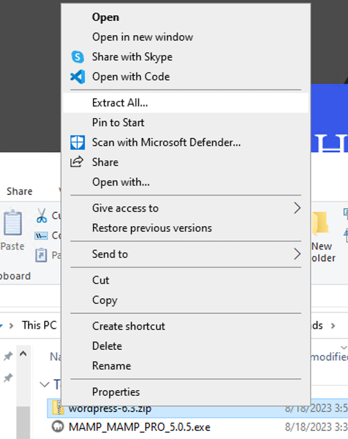
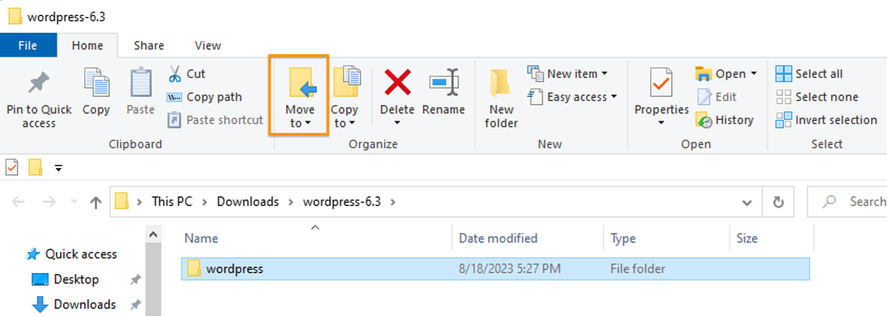
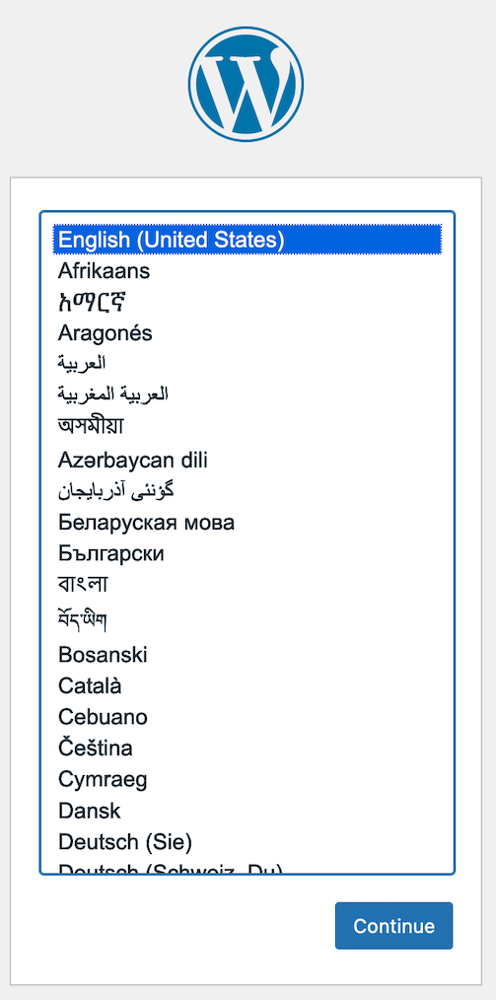

# Installing WordPress

## 1. Download WordPress

Download the WordPress software from [wordpress.org](https://wordpress.org/download/). It will download as a zip file, most like to `~/Downloads`. 

On a Mac, you can simply find the zip file in your GUI, move it to `/Applications/MAMP/htdocs` (Mac), and double-click it to unzip it. This will create a folder named `wordpress` alongside the zip file in `htdocs`.

In Windows, navigate to your Downloads folder and right-click on the zip file to extract the contents by selecting "Extract all". Don't change the destination where the files will be extracted.

When the extraction is completed, you'll find yourself with a folder named `wordpress` inside the destination. Use the "Move to" button to move the folder to `C:\MAMP\htdocs`.

Once you have the `wordpress` folder inside `htdocs`, take a peek inside the folder. Within, you'll see all the files and subfolders that make WordPress do its thing. 

  
*In this screenshot, the macOS finder shows the top-level WordPress files and folders in the leftmost column, with the contents of the `wp-content` subfolder showing in the middle column and the contents of the `themes` subfolder within it showing in the rightmost column.*

If you're seeing something like the above, you can safely delete the zip file.

## 2. Make the enclosing folder your document root

Launch MAMP, and, before you start up your Apache and MySQL servers, go to Preferences and set the document root as `Applications > MAMP > htdocs > wordpress` (Mac) or `C:\MAMP\htdocs\wordpress` (Windows). Later, we'll have an `omeka` folder inside `htdocs` alongside the `wordpress` one. Changing the document root from one to the other will enable us to switch back and forth between WordPress and Omeka. After changing the document root, start up the Apache and MySQL servers.

{: .tip}
If the servers start up automatically when you launch the application, shut them down before changing the document root. Once you've made the change, start the servers up again. When you have a chance, you may want to go into the MAMP preferences and disable server startup on launch. You can just start the servers manually each time you start up MAMP.

## 3. Create a database

Now it's time to create the database that WordPress will use to store its content. From MAMP's WebStart page, go to Tools > phpMyAdmin, click the "Databases" tab, enter `wordpress` as your database name, and make sure that `utf8_general_ci` is selected from the dropdown. Then click "Create". Your database is now created.

## 4. Set up WordPress

On the MAMP WebStart page, click the "My Website" link, or point your browser to `localhost:8888` (Mac) or `localhost/MAMP/` (Windows). You should see a WordPress page asking you to choose a language.

After choosing a language, you'll be prompted to make sure you have some information about your database.

Click **Let's go!**

Now it's time to give WordPress the information it needs to connect to your database. If you named your database `wordpress` in phpMyAdmin, type `wordpress` in the "Database Name" field (as the form will prompt you to do by default). If for any reason you named your database differently, fill in the field with your actual database name.

Username and password should both be `root`.

For "Database Host" supply `localhost:8889` for Mac, but leave the value as `localhost` if using port 3306 on Windows.

Leave the table prefix as `wp_`.

Click **Submit**.

{: .tip}
If at any point in the WordPress setup process, you get the message "Error establishing a database connection" in your browser, retrace your steps and make sure you properly followed the instructions for installing MAMP, setting MAMP preferences, creating your database, and filling out the database connection information for WordPress.

If WordPress succeeded in connecting to your database, you'll see a message with the button "Run the installation". Click the button.

## Create your login credentials

The final step is to complete the short form asking for a site name, a username, a password, and an email address. Don't sweat the site name: you can change it down the road. Do be sure to record your username and password somewhere so that you don't find yourself locked out of your site. (Supplying your email address should enable you to get a recovery email if you do.) 

Click **Install WordPress**.

When the installation finishes, you'll get a message with "Success!" at the top and a login link at the bottom. Follow the link and log in to your new WordPress site with the username and password you created.

You'll land at the WordPress Dashboard. This is the site's back end, where you can customize its appearance, add plugins, and create new pages and posts. 

{: .tip} 
Note the Dashboard's location in your browser: `localhost:8888/wp-admin` (Mac) or `localhost/MAMP/wp-admin`. You can always get to the login screen by using the admin address, even if you don't include a "log in" button on the site. The site itself will be at `localhost:8888` or `localhost/MAMP/`.

